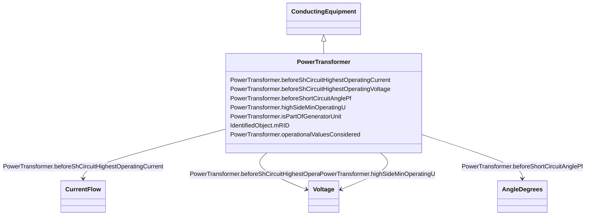

# PowerTransformer

_An electrical device consisting of  two or more coupled windings, with or without a magnetic core, for introducing mutual coupling between electric circuits. Transformers can be used to control voltage and phase shift (active power flow)._

_A power transformer may be composed of separate transformer tanks that need not be identical._

_A power transformer can be modelled with or without tanks and is intended for use in both balanced and unbalanced representations.   A power transformer typically has two terminals, but may have one (grounding), three or more terminals._

_The inherited association ConductingEquipment.BaseVoltage should not be used.  The association from TransformerEnd to BaseVoltage should be used instead._

**URI**: [cim:PowerTransformer](http://iec.ch/TC57/CIM100#PowerTransformer) 
**Type**: Class

## Inheritance
* [IdentifiedObject](IdentifiedObject.md)
    * [PowerSystemResource](PowerSystemResource.md)
        * [Equipment](Equipment.md)
            * [ConductingEquipment](ConductingEquipment.md)
                * **PowerTransformer**

## Attributes

| Name | URI | Cardinality and Range | Description | Inheritance |
| ---  | --- | --- | --- | --- |
| beforeShCircuitHighestOperatingCurrent | [cim:PowerTransformer.beforeShCircuitHighestOperatingCurrent](http://iec.ch/TC57/CIM100#PowerTransformer.beforeShCircuitHighestOperatingCurrent) | 0..1    [CurrentFlow](CurrentFlow.md)  | The highest operating current (Ib in IEC 60909-0) before short circuit (depen... | direct |
| beforeShCircuitHighestOperatingVoltage | [cim:PowerTransformer.beforeShCircuitHighestOperatingVoltage](http://iec.ch/TC57/CIM100#PowerTransformer.beforeShCircuitHighestOperatingVoltage) | 0..1    [Voltage](Voltage.md)  | The highest operating voltage (Ub in IEC 60909-0) before short circuit | direct |
| beforeShortCircuitAnglePf | [cim:PowerTransformer.beforeShortCircuitAnglePf](http://iec.ch/TC57/CIM100#PowerTransformer.beforeShortCircuitAnglePf) | 0..1    [AngleDegrees](AngleDegrees.md)  | The angle of power factor before short circuit (phib in IEC 60909-0) | direct |
| highSideMinOperatingU | [cim:PowerTransformer.highSideMinOperatingU](http://iec.ch/TC57/CIM100#PowerTransformer.highSideMinOperatingU) | 0..1    [Voltage](Voltage.md)  | The minimum operating voltage (uQmin in IEC 60909-0) at the high voltage side... | direct |
| isPartOfGeneratorUnit | [cim:PowerTransformer.isPartOfGeneratorUnit](http://iec.ch/TC57/CIM100#PowerTransformer.isPartOfGeneratorUnit) | 1..1    boolean  | Indicates whether the machine is part of a power station unit | direct |
| operationalValuesConsidered | [cim:PowerTransformer.operationalValuesConsidered](http://iec.ch/TC57/CIM100#PowerTransformer.operationalValuesConsidered) | 0..1    boolean  | It is used to define if the data (other attributes related to short circuit d... | direct |
| mRID | [cim:IdentifiedObject.mRID](http://iec.ch/TC57/CIM100#IdentifiedObject.mRID) | 1..1    string  | Master resource identifier issued by a model authority | [IdentifiedObject](IdentifiedObject.md) |

## Identifier and Mapping Information

### Schema Source

* from schema: http://iec.ch/TC57/ns/CIM/ShortCircuit-EU#Package_ShortCircuitProfile

## Mappings

| Mapping Type | Mapped Value |
| ---  | ---  |
| self | cim:PowerTransformer |
| native | this:PowerTransformer |

