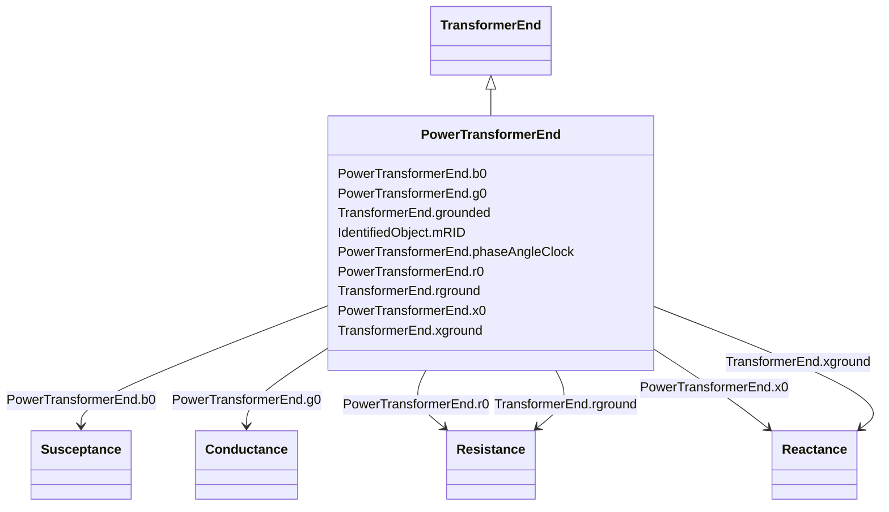

# PowerTransformerEnd

_A PowerTransformerEnd is associated with each Terminal of a PowerTransformer._

_The impedance values r, r0, x, and x0 of a PowerTransformerEnd represents a star equivalent as follows._

_1) for a two Terminal PowerTransformer the high voltage (TransformerEnd.endNumber=1) PowerTransformerEnd has non zero values on r, r0, x, and x0 while the low voltage (TransformerEnd.endNumber=2) PowerTransformerEnd has zero values for r, r0, x, and x0.  Parameters are always provided, even if the PowerTransformerEnds have the same rated voltage.  In this case, the parameters are provided at the PowerTransformerEnd which has TransformerEnd.endNumber equal to 1._

_2) for a three Terminal PowerTransformer the three PowerTransformerEnds represent a star equivalent with each leg in the star represented by r, r0, x, and x0 values._

_3) For a three Terminal transformer each PowerTransformerEnd shall have g, g0, b and b0 values corresponding to the no load losses distributed on the three PowerTransformerEnds. The total no load loss shunt impedances may also be placed at one of the PowerTransformerEnds, preferably the end numbered 1, having the shunt values on end 1.  This is the preferred way._

_4) for a PowerTransformer with more than three Terminals the PowerTransformerEnd impedance values cannot be used. Instead use the TransformerMeshImpedance or split the transformer into multiple PowerTransformers._

_Each PowerTransformerEnd must be contained by a PowerTransformer. Because a PowerTransformerEnd (or any other object) can not be contained by more than one parent, a PowerTransformerEnd can not have an association to an EquipmentContainer (Substation, VoltageLevel, etc)._

**URI**: [cim:PowerTransformerEnd](http://iec.ch/TC57/CIM100#PowerTransformerEnd) 
**Type**: Class

## Inheritance
* [IdentifiedObject](IdentifiedObject.md)
    * [TransformerEnd](TransformerEnd.md)
        * **PowerTransformerEnd**

## Attributes

| Name | URI | Cardinality and Range | Description | Inheritance |
| ---  | --- | --- | --- | --- |
| b0 | [cim:PowerTransformerEnd.b0](http://iec.ch/TC57/CIM100#PowerTransformerEnd.b0) | 1    [Susceptance](Susceptance.md)  | Zero sequence magnetizing branch susceptance | direct |
| phaseAngleClock | [cim:PowerTransformerEnd.phaseAngleClock](http://iec.ch/TC57/CIM100#PowerTransformerEnd.phaseAngleClock) | 1    integer  | Terminal voltage phase angle displacement where 360 degrees are represented w... | direct |
| g0 | [cim:PowerTransformerEnd.g0](http://iec.ch/TC57/CIM100#PowerTransformerEnd.g0) | 1    [Conductance](Conductance.md)  | Zero sequence magnetizing branch conductance (star-model) | direct |
| r0 | [cim:PowerTransformerEnd.r0](http://iec.ch/TC57/CIM100#PowerTransformerEnd.r0) | 1    [Resistance](Resistance.md)  | Zero sequence series resistance (star-model) of the transformer end | direct |
| x0 | [cim:PowerTransformerEnd.x0](http://iec.ch/TC57/CIM100#PowerTransformerEnd.x0) | 1    [Reactance](Reactance.md)  | Zero sequence series reactance of the transformer end | direct |
| rground | [cim:TransformerEnd.rground](http://iec.ch/TC57/CIM100#TransformerEnd.rground) | 0..1    [Resistance](Resistance.md)  | (for Yn and Zn connections) Resistance part of neutral impedance where 'groun... | [TransformerEnd](TransformerEnd.md) |
| grounded | [cim:TransformerEnd.grounded](http://iec.ch/TC57/CIM100#TransformerEnd.grounded) | 1    boolean  | (for Yn and Zn connections) True if the neutral is solidly grounded | [TransformerEnd](TransformerEnd.md) |
| xground | [cim:TransformerEnd.xground](http://iec.ch/TC57/CIM100#TransformerEnd.xground) | 0..1    [Reactance](Reactance.md)  | (for Yn and Zn connections) Reactive part of neutral impedance where 'grounde... | [TransformerEnd](TransformerEnd.md) |
| mRID | [cim:IdentifiedObject.mRID](http://iec.ch/TC57/CIM100#IdentifiedObject.mRID) | 1    string  | Master resource identifier issued by a model authority | [IdentifiedObject](IdentifiedObject.md) |

## Identifier and Mapping Information

### Schema Source

* from schema: http://iec.ch/TC57/ns/CIM/ShortCircuit-EU#Package_ShortCircuitProfile

## Mappings

| Mapping Type | Mapped Value |
| ---  | ---  |
| self | cim:PowerTransformerEnd |
| native | this:PowerTransformerEnd |

