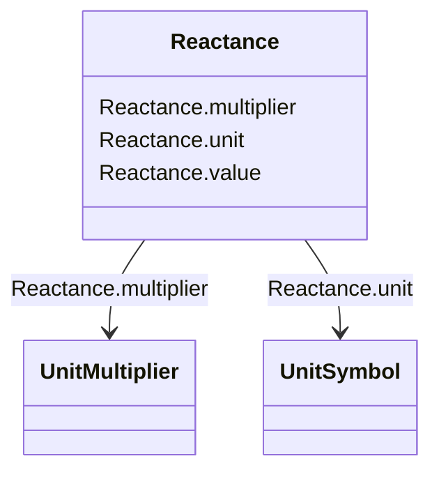

# Reactance

_Reactance (imaginary part of impedance), at rated frequency._

**URI**: [cim:Reactance](http://iec.ch/TC57/CIM100#Reactance) 
**Type**: Class

<!-- no inheritance hierarchy -->

## Attributes

| Name | URI | Cardinality and Range | Description | Inheritance |
| ---  | --- | --- | --- | --- |
| value | [cim:Reactance.value](http://iec.ch/TC57/CIM100#Reactance.value) | 0..1    float  |  | direct |
| unit | [cim:Reactance.unit](http://iec.ch/TC57/CIM100#Reactance.unit) | 0..1    [UnitSymbol](UnitSymbol.md)  |  | direct |
| multiplier | [cim:Reactance.multiplier](http://iec.ch/TC57/CIM100#Reactance.multiplier) | 0..1    [UnitMultiplier](UnitMultiplier.md)  |  | direct |

## Usages

| used by | used in | type | used |
| ---  | --- | --- | --- |
| [ACLineSegment](ACLineSegment.md) | x0 | range | [Reactance](Reactance.md) |
| [EnergySource](EnergySource.md) | x | range | [Reactance](Reactance.md) |
| [EnergySource](EnergySource.md) | x0 | range | [Reactance](Reactance.md) |
| [EnergySource](EnergySource.md) | xn | range | [Reactance](Reactance.md) |
| [EquivalentBranch](EquivalentBranch.md) | negativeX12 | range | [Reactance](Reactance.md) |
| [EquivalentBranch](EquivalentBranch.md) | negativeX21 | range | [Reactance](Reactance.md) |
| [EquivalentBranch](EquivalentBranch.md) | positiveX12 | range | [Reactance](Reactance.md) |
| [EquivalentBranch](EquivalentBranch.md) | positiveX21 | range | [Reactance](Reactance.md) |
| [EquivalentBranch](EquivalentBranch.md) | zeroX12 | range | [Reactance](Reactance.md) |
| [EquivalentBranch](EquivalentBranch.md) | zeroX21 | range | [Reactance](Reactance.md) |
| [EquivalentInjection](EquivalentInjection.md) | x | range | [Reactance](Reactance.md) |
| [EquivalentInjection](EquivalentInjection.md) | x0 | range | [Reactance](Reactance.md) |
| [EquivalentInjection](EquivalentInjection.md) | x2 | range | [Reactance](Reactance.md) |
| [GroundingImpedance](GroundingImpedance.md) | x | range | [Reactance](Reactance.md) |
| [MutualCoupling](MutualCoupling.md) | x0 | range | [Reactance](Reactance.md) |
| [PetersenCoil](PetersenCoil.md) | xGroundMax | range | [Reactance](Reactance.md) |
| [PetersenCoil](PetersenCoil.md) | xGroundMin | range | [Reactance](Reactance.md) |
| [PetersenCoil](PetersenCoil.md) | xGroundNominal | range | [Reactance](Reactance.md) |
| [PowerTransformerEnd](PowerTransformerEnd.md) | x0 | range | [Reactance](Reactance.md) |
| [PowerTransformerEnd](PowerTransformerEnd.md) | xground | range | [Reactance](Reactance.md) |
| [SeriesCompensator](SeriesCompensator.md) | x0 | range | [Reactance](Reactance.md) |
| [SynchronousMachine](SynchronousMachine.md) | earthingStarPointX | range | [Reactance](Reactance.md) |
| [SynchronousMachine](SynchronousMachine.md) | x0 | range | [Reactance](Reactance.md) |
| [SynchronousMachine](SynchronousMachine.md) | x2 | range | [Reactance](Reactance.md) |
| [TransformerEnd](TransformerEnd.md) | xground | range | [Reactance](Reactance.md) |

## Identifier and Mapping Information

### Schema Source

* from schema: http://iec.ch/TC57/ns/CIM/ShortCircuit-EU#Package_ShortCircuitProfile

## Mappings

| Mapping Type | Mapped Value |
| ---  | ---  |
| self | cim:Reactance |
| native | this:Reactance |

