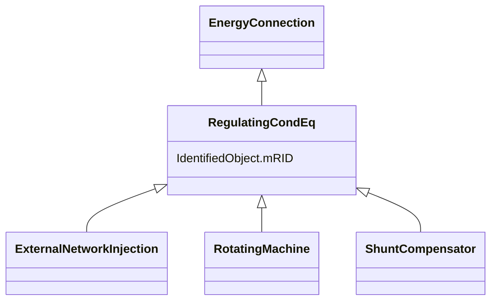

# RegulatingCondEq

_A type of conducting equipment that can regulate a quantity (i.e. voltage or flow) at a specific point in the network._

**URI**: [cim:RegulatingCondEq](http://iec.ch/TC57/CIM100#RegulatingCondEq) 
**Type**: Class

## Inheritance
* [IdentifiedObject](IdentifiedObject.md)
    * [PowerSystemResource](PowerSystemResource.md)
        * [Equipment](Equipment.md)
            * [ConductingEquipment](ConductingEquipment.md)
                * [EnergyConnection](EnergyConnection.md)
                    * **RegulatingCondEq**
                        * [ExternalNetworkInjection](ExternalNetworkInjection.md)
                        * [RotatingMachine](RotatingMachine.md)
                        * [ShuntCompensator](ShuntCompensator.md)

## Attributes

| Name | URI | Cardinality and Range | Description | Inheritance |
| ---  | --- | --- | --- | --- |
| mRID | [cim:IdentifiedObject.mRID](http://iec.ch/TC57/CIM100#IdentifiedObject.mRID) | 1..1    string  | Master resource identifier issued by a model authority | [IdentifiedObject](IdentifiedObject.md) |

## Identifier and Mapping Information

### Schema Source

* from schema: http://iec.ch/TC57/ns/CIM/ShortCircuit-EU#Package_ShortCircuitProfile

## Mappings

| Mapping Type | Mapped Value |
| ---  | ---  |
| self | cim:RegulatingCondEq |
| native | this:RegulatingCondEq |

