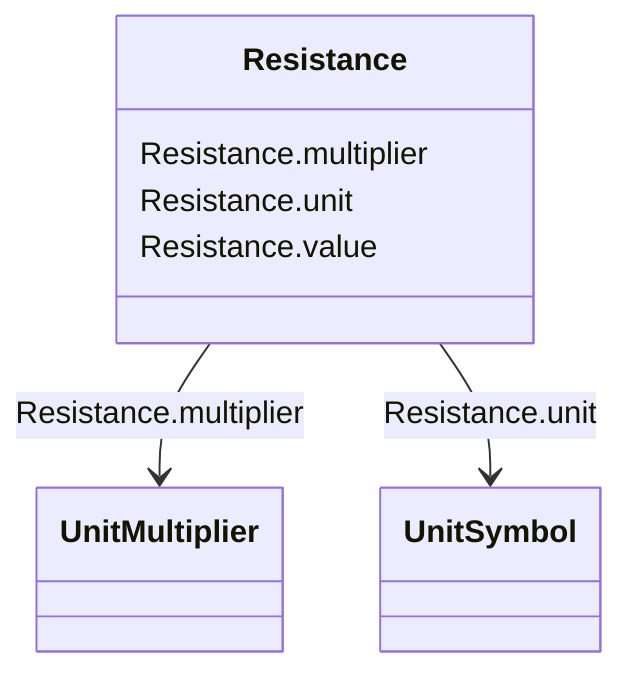

# Resistance

_Resistance (real part of impedance)._

**URI**: [cim:Resistance](http://iec.ch/TC57/CIM100#Resistance) 
**Type**: Class

<!-- no inheritance hierarchy -->

## Attributes

| Name | URI | Cardinality and Range | Description | Inheritance |
| ---  | --- | --- | --- | --- |
| value | [cim:Resistance.value](http://iec.ch/TC57/CIM100#Resistance.value) | 0..1    float  |  | direct |
| unit | [cim:Resistance.unit](http://iec.ch/TC57/CIM100#Resistance.unit) | 0..1    [UnitSymbol](UnitSymbol.md)  |  | direct |
| multiplier | [cim:Resistance.multiplier](http://iec.ch/TC57/CIM100#Resistance.multiplier) | 0..1    [UnitMultiplier](UnitMultiplier.md)  |  | direct |

## Usages

| used by | used in | type | used |
| ---  | --- | --- | --- |
| [ACLineSegment](ACLineSegment.md) | r0 | range | [Resistance](Resistance.md) |
| [EarthFaultCompensator](EarthFaultCompensator.md) | r | range | [Resistance](Resistance.md) |
| [EnergySource](EnergySource.md) | r | range | [Resistance](Resistance.md) |
| [EnergySource](EnergySource.md) | r0 | range | [Resistance](Resistance.md) |
| [EnergySource](EnergySource.md) | rn | range | [Resistance](Resistance.md) |
| [EquivalentBranch](EquivalentBranch.md) | negativeR12 | range | [Resistance](Resistance.md) |
| [EquivalentBranch](EquivalentBranch.md) | negativeR21 | range | [Resistance](Resistance.md) |
| [EquivalentBranch](EquivalentBranch.md) | positiveR12 | range | [Resistance](Resistance.md) |
| [EquivalentBranch](EquivalentBranch.md) | positiveR21 | range | [Resistance](Resistance.md) |
| [EquivalentBranch](EquivalentBranch.md) | zeroR12 | range | [Resistance](Resistance.md) |
| [EquivalentBranch](EquivalentBranch.md) | zeroR21 | range | [Resistance](Resistance.md) |
| [EquivalentInjection](EquivalentInjection.md) | r | range | [Resistance](Resistance.md) |
| [EquivalentInjection](EquivalentInjection.md) | r0 | range | [Resistance](Resistance.md) |
| [EquivalentInjection](EquivalentInjection.md) | r2 | range | [Resistance](Resistance.md) |
| [GroundingImpedance](GroundingImpedance.md) | r | range | [Resistance](Resistance.md) |
| [MutualCoupling](MutualCoupling.md) | r0 | range | [Resistance](Resistance.md) |
| [PetersenCoil](PetersenCoil.md) | r | range | [Resistance](Resistance.md) |
| [PowerTransformerEnd](PowerTransformerEnd.md) | r0 | range | [Resistance](Resistance.md) |
| [PowerTransformerEnd](PowerTransformerEnd.md) | rground | range | [Resistance](Resistance.md) |
| [SeriesCompensator](SeriesCompensator.md) | r0 | range | [Resistance](Resistance.md) |
| [SynchronousMachine](SynchronousMachine.md) | earthingStarPointR | range | [Resistance](Resistance.md) |
| [SynchronousMachine](SynchronousMachine.md) | r0 | range | [Resistance](Resistance.md) |
| [SynchronousMachine](SynchronousMachine.md) | r2 | range | [Resistance](Resistance.md) |
| [SynchronousMachine](SynchronousMachine.md) | r | range | [Resistance](Resistance.md) |
| [TransformerEnd](TransformerEnd.md) | rground | range | [Resistance](Resistance.md) |

## Identifier and Mapping Information

### Schema Source

* from schema: http://iec.ch/TC57/ns/CIM/ShortCircuit-EU#Package_ShortCircuitProfile

## Mappings

| Mapping Type | Mapped Value |
| ---  | ---  |
| self | cim:Resistance |
| native | this:Resistance |

