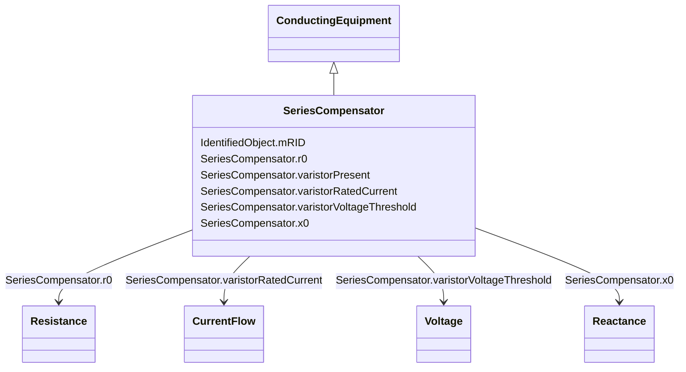

# SeriesCompensator

_A Series Compensator is a series capacitor or reactor or an AC transmission line without charging susceptance.  It is a two terminal device._

**URI**: [cim:SeriesCompensator](http://iec.ch/TC57/CIM100#SeriesCompensator) 
**Type**: Class

## Inheritance
* [IdentifiedObject](IdentifiedObject.md)
    * [PowerSystemResource](PowerSystemResource.md)
        * [Equipment](Equipment.md)
            * [ConductingEquipment](ConductingEquipment.md)
                * **SeriesCompensator**

## Attributes

| Name | URI | Cardinality and Range | Description | Inheritance |
| ---  | --- | --- | --- | --- |
| r0 | [cim:SeriesCompensator.r0](http://iec.ch/TC57/CIM100#SeriesCompensator.r0) | 1..1    [Resistance](Resistance.md)  | Zero sequence resistance | direct |
| x0 | [cim:SeriesCompensator.x0](http://iec.ch/TC57/CIM100#SeriesCompensator.x0) | 1..1    [Reactance](Reactance.md)  | Zero sequence reactance | direct |
| varistorPresent | [cim:SeriesCompensator.varistorPresent](http://iec.ch/TC57/CIM100#SeriesCompensator.varistorPresent) | 1..1    boolean  | Describe if a metal oxide varistor (mov) for over voltage protection is confi... | direct |
| varistorRatedCurrent | [cim:SeriesCompensator.varistorRatedCurrent](http://iec.ch/TC57/CIM100#SeriesCompensator.varistorRatedCurrent) | 0..1    [CurrentFlow](CurrentFlow.md)  | The maximum current the varistor is designed to handle at specified duration | direct |
| varistorVoltageThreshold | [cim:SeriesCompensator.varistorVoltageThreshold](http://iec.ch/TC57/CIM100#SeriesCompensator.varistorVoltageThreshold) | 0..1    [Voltage](Voltage.md)  | The dc voltage at which the varistor starts conducting | direct |
| mRID | [cim:IdentifiedObject.mRID](http://iec.ch/TC57/CIM100#IdentifiedObject.mRID) | 1..1    string  | Master resource identifier issued by a model authority | [IdentifiedObject](IdentifiedObject.md) |

## Identifier and Mapping Information

### Schema Source

* from schema: http://iec.ch/TC57/ns/CIM/ShortCircuit-EU#Package_ShortCircuitProfile

## Mappings

| Mapping Type | Mapped Value |
| ---  | ---  |
| self | cim:SeriesCompensator |
| native | this:SeriesCompensator |

