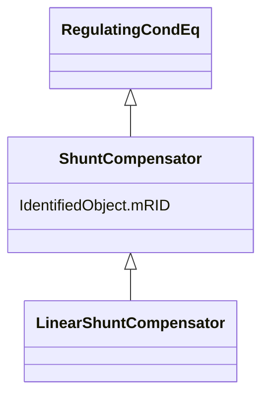

# ShuntCompensator

_A shunt capacitor or reactor or switchable bank of shunt capacitors or reactors. A section of a shunt compensator is an individual capacitor or reactor. A negative value for bPerSection indicates that the compensator is a reactor. ShuntCompensator is a single terminal device.  Ground is implied._

**URI**: [cim:ShuntCompensator](http://iec.ch/TC57/CIM100#ShuntCompensator) 
**Type**: Class

## Inheritance
* [IdentifiedObject](IdentifiedObject.md)
    * [PowerSystemResource](PowerSystemResource.md)
        * [Equipment](Equipment.md)
            * [ConductingEquipment](ConductingEquipment.md)
                * [EnergyConnection](EnergyConnection.md)
                    * [RegulatingCondEq](RegulatingCondEq.md)
                        * **ShuntCompensator**
                            * [LinearShuntCompensator](LinearShuntCompensator.md)

## Attributes

| Name | URI | Cardinality and Range | Description | Inheritance |
| ---  | --- | --- | --- | --- |
| mRID | [cim:IdentifiedObject.mRID](http://iec.ch/TC57/CIM100#IdentifiedObject.mRID) | 1..1    string  | Master resource identifier issued by a model authority | [IdentifiedObject](IdentifiedObject.md) |

## Identifier and Mapping Information

### Schema Source

* from schema: http://iec.ch/TC57/ns/CIM/ShortCircuit-EU#Package_ShortCircuitProfile

## Mappings

| Mapping Type | Mapped Value |
| ---  | ---  |
| self | cim:ShuntCompensator |
| native | this:ShuntCompensator |

