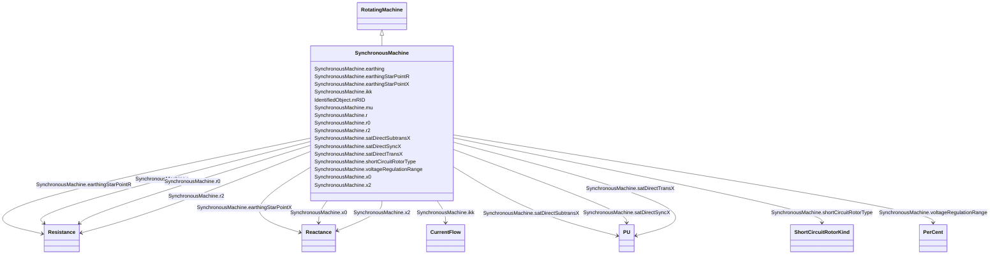

# SynchronousMachine

_An electromechanical device that operates with shaft rotating synchronously with the network. It is a single machine operating either as a generator or synchronous condenser or pump._

**URI**: [cim:SynchronousMachine](http://iec.ch/TC57/CIM100#SynchronousMachine) 
**Type**: Class

## Inheritance
* [IdentifiedObject](IdentifiedObject.md)
    * [PowerSystemResource](PowerSystemResource.md)
        * [Equipment](Equipment.md)
            * [ConductingEquipment](ConductingEquipment.md)
                * [EnergyConnection](EnergyConnection.md)
                    * [RegulatingCondEq](RegulatingCondEq.md)
                        * [RotatingMachine](RotatingMachine.md)
                            * **SynchronousMachine**

## Attributes

| Name | URI | Cardinality and Range | Description | Inheritance |
| ---  | --- | --- | --- | --- |
| earthing | [cim:SynchronousMachine.earthing](http://iec.ch/TC57/CIM100#SynchronousMachine.earthing) | 1..1    boolean  | Indicates whether or not the generator is earthed | direct |
| earthingStarPointR | [cim:SynchronousMachine.earthingStarPointR](http://iec.ch/TC57/CIM100#SynchronousMachine.earthingStarPointR) | 0..1    [Resistance](Resistance.md)  | Generator star point earthing resistance (Re) | direct |
| earthingStarPointX | [cim:SynchronousMachine.earthingStarPointX](http://iec.ch/TC57/CIM100#SynchronousMachine.earthingStarPointX) | 0..1    [Reactance](Reactance.md)  | Generator star point earthing reactance (Xe) | direct |
| ikk | [cim:SynchronousMachine.ikk](http://iec.ch/TC57/CIM100#SynchronousMachine.ikk) | 0..1    [CurrentFlow](CurrentFlow.md)  | Steady-state short-circuit current (in A for the profile) of generator with c... | direct |
| mu | [cim:SynchronousMachine.mu](http://iec.ch/TC57/CIM100#SynchronousMachine.mu) | 0..1    float  | Factor to calculate the breaking current (Section 4 | direct |
| x0 | [cim:SynchronousMachine.x0](http://iec.ch/TC57/CIM100#SynchronousMachine.x0) | 1..1    [Reactance](Reactance.md)  | Zero sequence reactance of the synchronous machine | direct |
| r0 | [cim:SynchronousMachine.r0](http://iec.ch/TC57/CIM100#SynchronousMachine.r0) | 1..1    [Resistance](Resistance.md)  | Zero sequence resistance of the synchronous machine | direct |
| x2 | [cim:SynchronousMachine.x2](http://iec.ch/TC57/CIM100#SynchronousMachine.x2) | 1..1    [Reactance](Reactance.md)  | Negative sequence reactance | direct |
| r2 | [cim:SynchronousMachine.r2](http://iec.ch/TC57/CIM100#SynchronousMachine.r2) | 1..1    [Resistance](Resistance.md)  | Negative sequence resistance | direct |
| r | [cim:SynchronousMachine.r](http://iec.ch/TC57/CIM100#SynchronousMachine.r) | 1..1    [Resistance](Resistance.md)  | Equivalent resistance (RG) of generator | direct |
| satDirectSubtransX | [cim:SynchronousMachine.satDirectSubtransX](http://iec.ch/TC57/CIM100#SynchronousMachine.satDirectSubtransX) | 1..1    [PU](PU.md)  | Direct-axis subtransient reactance saturated, also known as Xd"sat | direct |
| satDirectSyncX | [cim:SynchronousMachine.satDirectSyncX](http://iec.ch/TC57/CIM100#SynchronousMachine.satDirectSyncX) | 0..1    [PU](PU.md)  | Direct-axes saturated synchronous reactance (xdsat); reciprocal of short-circ... | direct |
| satDirectTransX | [cim:SynchronousMachine.satDirectTransX](http://iec.ch/TC57/CIM100#SynchronousMachine.satDirectTransX) | 0..1    [PU](PU.md)  | Saturated Direct-axis transient reactance | direct |
| shortCircuitRotorType | [cim:SynchronousMachine.shortCircuitRotorType](http://iec.ch/TC57/CIM100#SynchronousMachine.shortCircuitRotorType) | 0..1    [ShortCircuitRotorKind](ShortCircuitRotorKind.md)  | Type of rotor, used by short circuit applications, only for single fed short ... | direct |
| voltageRegulationRange | [cim:SynchronousMachine.voltageRegulationRange](http://iec.ch/TC57/CIM100#SynchronousMachine.voltageRegulationRange) | 0..1    [PerCent](PerCent.md)  | Range of generator voltage regulation (PG in IEC 60909-0) used for calculatio... | direct |
| mRID | [cim:IdentifiedObject.mRID](http://iec.ch/TC57/CIM100#IdentifiedObject.mRID) | 1..1    string  | Master resource identifier issued by a model authority | [IdentifiedObject](IdentifiedObject.md) |

## Identifier and Mapping Information

### Schema Source

* from schema: http://iec.ch/TC57/ns/CIM/ShortCircuit-EU#Package_ShortCircuitProfile

## Mappings

| Mapping Type | Mapped Value |
| ---  | ---  |
| self | cim:SynchronousMachine |
| native | this:SynchronousMachine |

