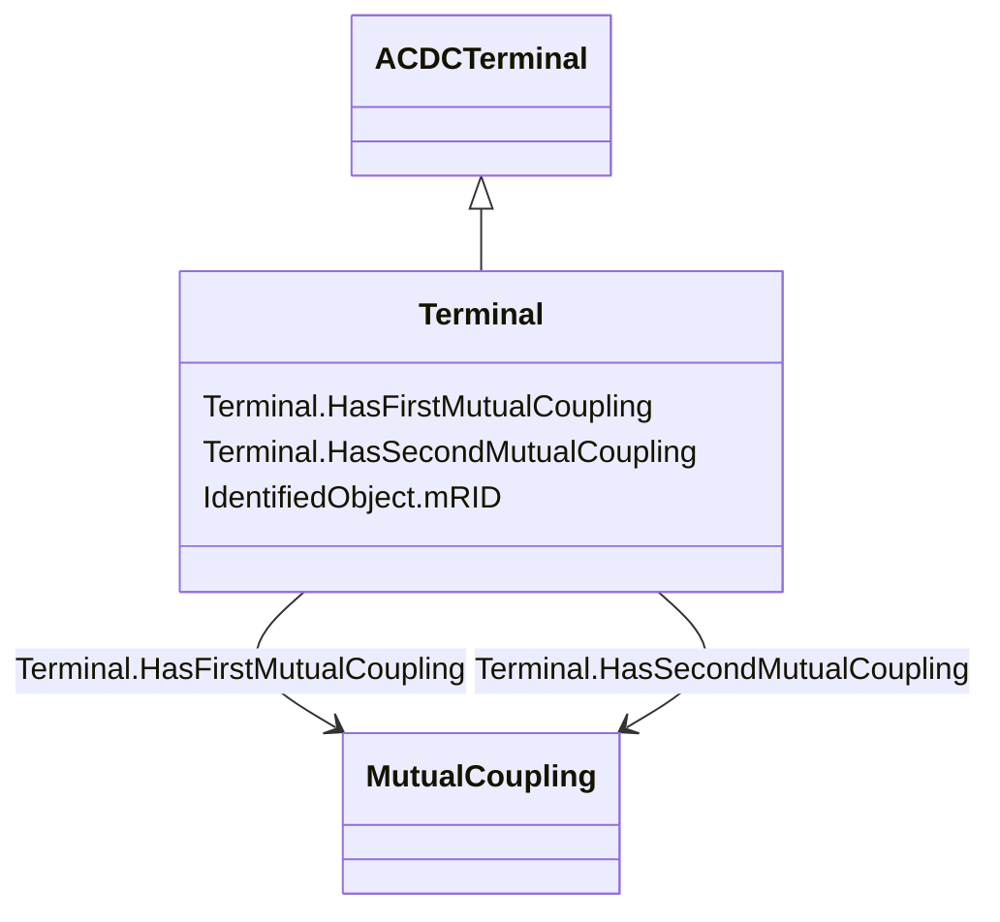

# Terminal

_An AC electrical connection point to a piece of conducting equipment. Terminals are connected at physical connection points called connectivity nodes._

**URI**: [cim:Terminal](http://iec.ch/TC57/CIM100#Terminal) 
**Type**: Class

## Inheritance
* [IdentifiedObject](IdentifiedObject.md)
    * [ACDCTerminal](ACDCTerminal.md)
        * **Terminal**

## Attributes

| Name | URI | Cardinality and Range | Description | Inheritance |
| ---  | --- | --- | --- | --- |
| HasSecondMutualCoupling | [cim:Terminal.HasSecondMutualCoupling](http://iec.ch/TC57/CIM100#Terminal.HasSecondMutualCoupling) | *    [MutualCoupling](MutualCoupling.md)  | Mutual couplings with the branch associated as the first branch | direct |
| HasFirstMutualCoupling | [cim:Terminal.HasFirstMutualCoupling](http://iec.ch/TC57/CIM100#Terminal.HasFirstMutualCoupling) | *    [MutualCoupling](MutualCoupling.md)  | Mutual couplings associated with the branch as the first branch | direct |
| mRID | [cim:IdentifiedObject.mRID](http://iec.ch/TC57/CIM100#IdentifiedObject.mRID) | 1    string  | Master resource identifier issued by a model authority | [IdentifiedObject](IdentifiedObject.md) |

## Usages

| used by | used in | type | used |
| ---  | --- | --- | --- |
| [MutualCoupling](MutualCoupling.md) | Second_Terminal | range | [Terminal](Terminal.md) |
| [MutualCoupling](MutualCoupling.md) | First_Terminal | range | [Terminal](Terminal.md) |

## Identifier and Mapping Information

### Schema Source

* from schema: http://iec.ch/TC57/ns/CIM/ShortCircuit-EU#Package_ShortCircuitProfile

## Mappings

| Mapping Type | Mapped Value |
| ---  | ---  |
| self | cim:Terminal |
| native | this:Terminal |

