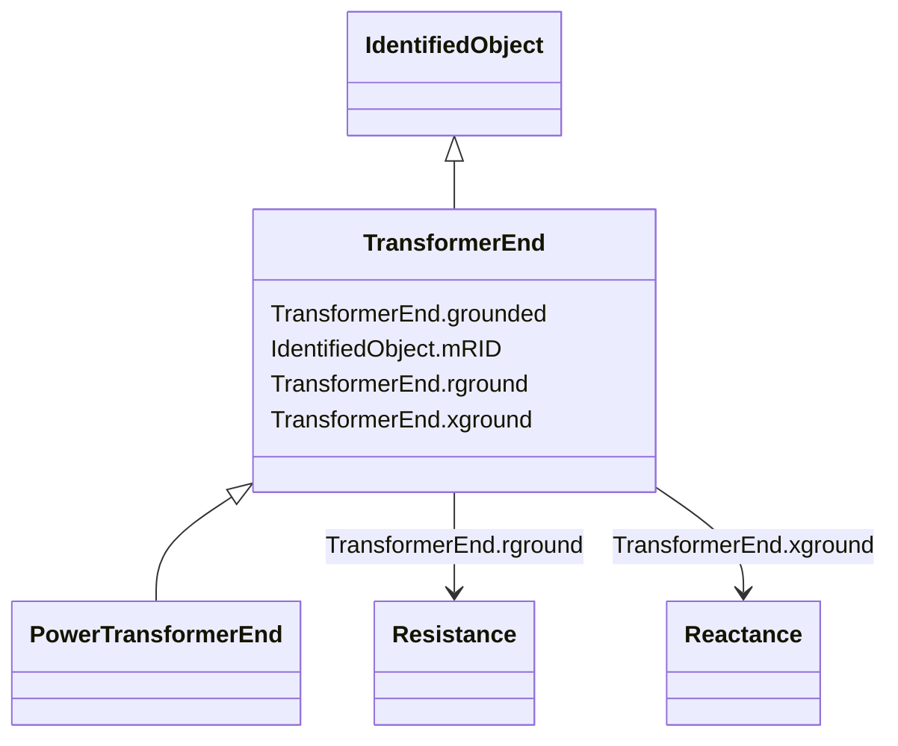

# TransformerEnd

_A conducting connection point of a power transformer. It corresponds to a physical transformer winding terminal.  In earlier CIM versions, the TransformerWinding class served a similar purpose, but this class is more flexible because it associates to terminal but is not a specialization of ConductingEquipment._

**URI**: [cim:TransformerEnd](http://iec.ch/TC57/CIM100#TransformerEnd) 
**Type**: Class

## Inheritance
* [IdentifiedObject](IdentifiedObject.md)
    * **TransformerEnd**
        * [PowerTransformerEnd](PowerTransformerEnd.md)

## Attributes

| Name | URI | Cardinality and Range | Description | Inheritance |
| ---  | --- | --- | --- | --- |
| rground | [cim:TransformerEnd.rground](http://iec.ch/TC57/CIM100#TransformerEnd.rground) | 0..1    [Resistance](Resistance.md)  | (for Yn and Zn connections) Resistance part of neutral impedance where 'groun... | direct |
| grounded | [cim:TransformerEnd.grounded](http://iec.ch/TC57/CIM100#TransformerEnd.grounded) | 1..1    boolean  | (for Yn and Zn connections) True if the neutral is solidly grounded | direct |
| xground | [cim:TransformerEnd.xground](http://iec.ch/TC57/CIM100#TransformerEnd.xground) | 0..1    [Reactance](Reactance.md)  | (for Yn and Zn connections) Reactive part of neutral impedance where 'grounde... | direct |
| mRID | [cim:IdentifiedObject.mRID](http://iec.ch/TC57/CIM100#IdentifiedObject.mRID) | 1..1    string  | Master resource identifier issued by a model authority | [IdentifiedObject](IdentifiedObject.md) |

## Identifier and Mapping Information

### Schema Source

* from schema: http://iec.ch/TC57/ns/CIM/ShortCircuit-EU#Package_ShortCircuitProfile

## Mappings

| Mapping Type | Mapped Value |
| ---  | ---  |
| self | cim:TransformerEnd |
| native | this:TransformerEnd |

