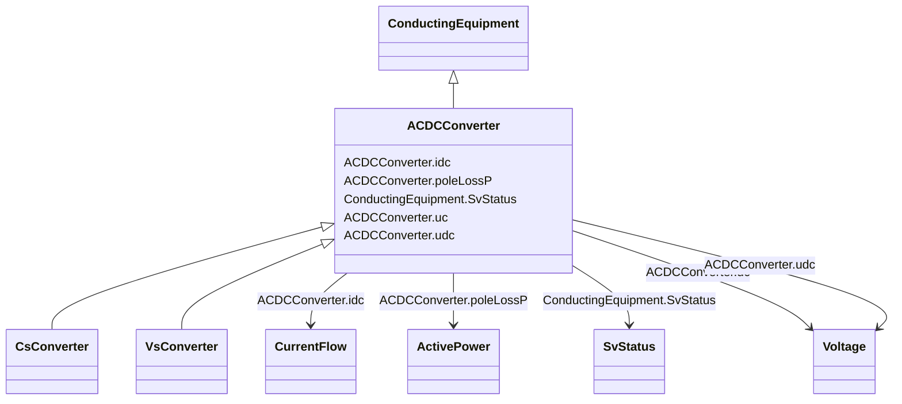

# ACDCConverter

_A unit with valves for three phases, together with unit control equipment, essential protective and switching devices, DC storage capacitors, phase reactors and auxiliaries, if any, used for conversion._

**URI**: [cim:ACDCConverter](http://iec.ch/TC57/CIM100#ACDCConverter) 
**Type**: Class

## Inheritance
* [ConductingEquipment](ConductingEquipment.md)
    * **ACDCConverter**
        * [CsConverter](CsConverter.md)
        * [VsConverter](VsConverter.md)

## Attributes

| Name | URI | Cardinality and Range | Description | Inheritance |
| ---  | --- | --- | --- | --- |
| idc | [cim:ACDCConverter.idc](http://iec.ch/TC57/CIM100#ACDCConverter.idc) | 1..1    [CurrentFlow](CurrentFlow.md)  | Converter DC current, also called Id | direct |
| poleLossP | [cim:ACDCConverter.poleLossP](http://iec.ch/TC57/CIM100#ACDCConverter.poleLossP) | 1..1    [ActivePower](ActivePower.md)  | The active power loss at a DC Pole  | direct |
| uc | [cim:ACDCConverter.uc](http://iec.ch/TC57/CIM100#ACDCConverter.uc) | 1..1    [Voltage](Voltage.md)  | Line-to-line converter voltage, the voltage at the AC side of the valve | direct |
| udc | [cim:ACDCConverter.udc](http://iec.ch/TC57/CIM100#ACDCConverter.udc) | 1..1    [Voltage](Voltage.md)  | Converter voltage at the DC side, also called Ud | direct |
| SvStatus | [cim:ConductingEquipment.SvStatus](http://iec.ch/TC57/CIM100#ConductingEquipment.SvStatus) | 0..1    [SvStatus](SvStatus.md)  | The status state variable associated with this conducting equipment | [ConductingEquipment](ConductingEquipment.md) |

## Identifier and Mapping Information

### Schema Source

* from schema: http://iec.ch/TC57/ns/CIM/StateVariables-EU#Package_StateVariablesProfile

## Mappings

| Mapping Type | Mapped Value |
| ---  | ---  |
| self | cim:ACDCConverter |
| native | this:ACDCConverter |

