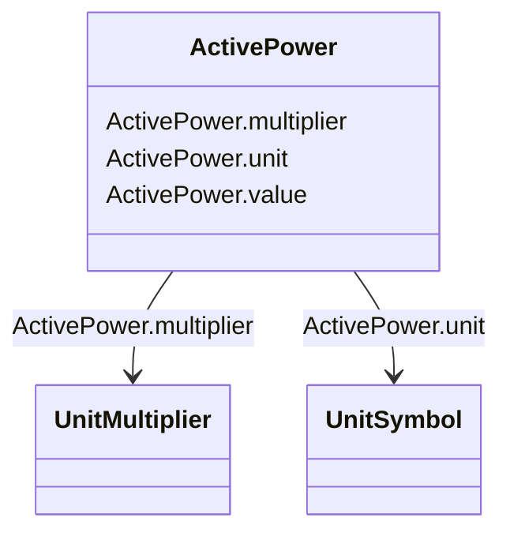

# ActivePower

_Product of RMS value of the voltage and the RMS value of the in-phase component of the current._

**URI**: [cim:ActivePower](http://iec.ch/TC57/CIM100#ActivePower) 
**Type**: Class

<!-- no inheritance hierarchy -->

## Attributes

| Name | URI | Cardinality and Range | Description | Inheritance |
| ---  | --- | --- | --- | --- |
| value | [cim:ActivePower.value](http://iec.ch/TC57/CIM100#ActivePower.value) | 0..1    float  |  | direct |
| multiplier | [cim:ActivePower.multiplier](http://iec.ch/TC57/CIM100#ActivePower.multiplier) | 0..1    [UnitMultiplier](UnitMultiplier.md)  |  | direct |
| unit | [cim:ActivePower.unit](http://iec.ch/TC57/CIM100#ActivePower.unit) | 0..1    [UnitSymbol](UnitSymbol.md)  |  | direct |

## Usages

| used by | used in | type | used |
| ---  | --- | --- | --- |
| [ACDCConverter](ACDCConverter.md) | poleLossP | range | [ActivePower](ActivePower.md) |
| [CsConverter](CsConverter.md) | poleLossP | range | [ActivePower](ActivePower.md) |
| [SvInjection](SvInjection.md) | pInjection | range | [ActivePower](ActivePower.md) |
| [SvPowerFlow](SvPowerFlow.md) | p | range | [ActivePower](ActivePower.md) |
| [VsConverter](VsConverter.md) | poleLossP | range | [ActivePower](ActivePower.md) |

## Identifier and Mapping Information

### Schema Source

* from schema: http://iec.ch/TC57/ns/CIM/StateVariables-EU#Package_StateVariablesProfile

## Mappings

| Mapping Type | Mapped Value |
| ---  | ---  |
| self | cim:ActivePower |
| native | this:ActivePower |

