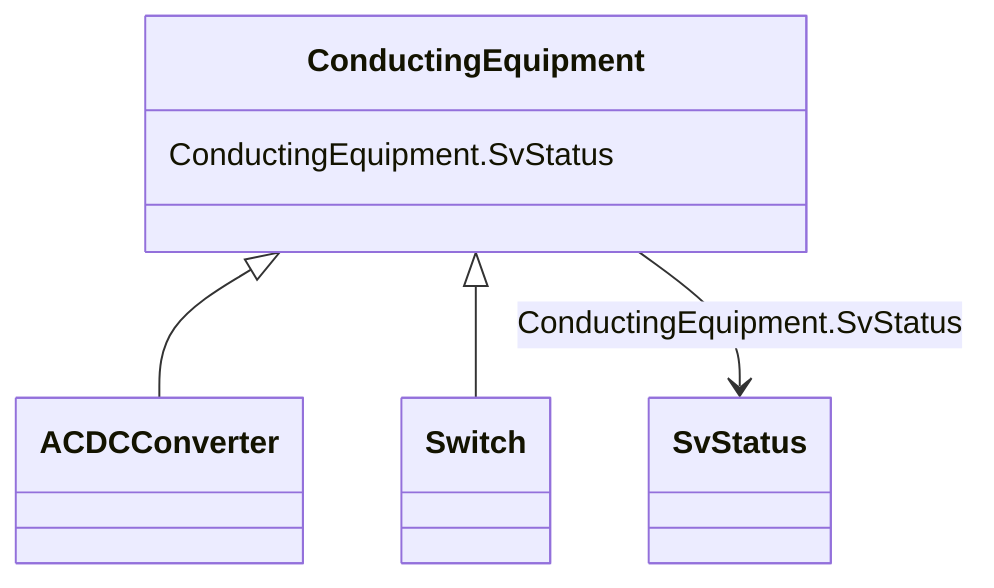

# ConductingEquipment

_The parts of the AC power system that are designed to carry current or that are conductively connected through terminals._

**URI**: [cim:ConductingEquipment](http://iec.ch/TC57/CIM100#ConductingEquipment) 
**Type**: Class

## Inheritance
* **ConductingEquipment**
    * [ACDCConverter](ACDCConverter.md)
    * [Switch](Switch.md)

## Attributes

| Name | URI | Cardinality and Range | Description | Inheritance |
| ---  | --- | --- | --- | --- |
| SvStatus | [cim:ConductingEquipment.SvStatus](http://iec.ch/TC57/CIM100#ConductingEquipment.SvStatus) | 0..1    [SvStatus](SvStatus.md)  | The status state variable associated with this conducting equipment | direct |

## Usages

| used by | used in | type | used |
| ---  | --- | --- | --- |
| [SvStatus](SvStatus.md) | ConductingEquipment | range | [ConductingEquipment](ConductingEquipment.md) |

## Identifier and Mapping Information

### Schema Source

* from schema: http://iec.ch/TC57/ns/CIM/StateVariables-EU#Package_StateVariablesProfile

## Mappings

| Mapping Type | Mapped Value |
| ---  | ---  |
| self | cim:ConductingEquipment |
| native | this:ConductingEquipment |

