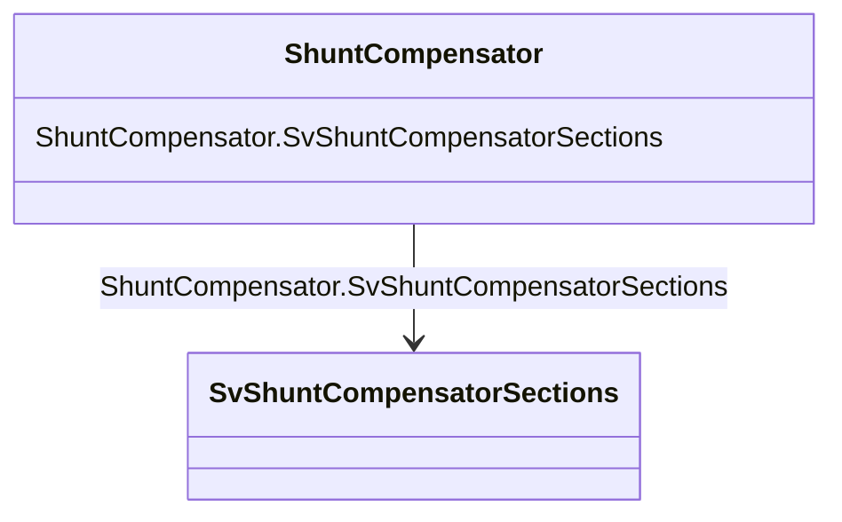

# ShuntCompensator

_A shunt capacitor or reactor or switchable bank of shunt capacitors or reactors. A section of a shunt compensator is an individual capacitor or reactor. A negative value for bPerSection indicates that the compensator is a reactor. ShuntCompensator is a single terminal device.  Ground is implied._

**URI**: [cim:ShuntCompensator](http://iec.ch/TC57/CIM100#ShuntCompensator) 
**Type**: Class

<!-- no inheritance hierarchy -->

## Attributes

| Name | URI | Cardinality and Range | Description | Inheritance |
| ---  | --- | --- | --- | --- |
| SvShuntCompensatorSections | [cim:ShuntCompensator.SvShuntCompensatorSections](http://iec.ch/TC57/CIM100#ShuntCompensator.SvShuntCompensatorSections) | 0..1    [SvShuntCompensatorSections](SvShuntCompensatorSections.md)  | The state for the number of shunt compensator sections in service | direct |

## Usages

| used by | used in | type | used |
| ---  | --- | --- | --- |
| [SvShuntCompensatorSections](SvShuntCompensatorSections.md) | ShuntCompensator | range | [ShuntCompensator](ShuntCompensator.md) |

## Identifier and Mapping Information

### Schema Source

* from schema: http://iec.ch/TC57/ns/CIM/StateVariables-EU#Package_StateVariablesProfile

## Mappings

| Mapping Type | Mapped Value |
| ---  | ---  |
| self | cim:ShuntCompensator |
| native | this:ShuntCompensator |

