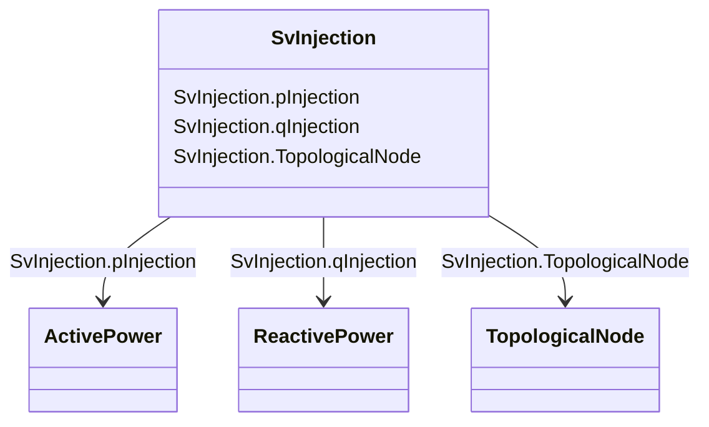

# SvInjection

_The SvInjection reports the calculated bus injection minus the sum of the terminal flows. The terminal flow is positive out from the bus (load sign convention) and bus injection has positive flow into the bus. SvInjection may have the remainder after state estimation or slack after power flow calculation._

**URI**: [cim:SvInjection](http://iec.ch/TC57/CIM100#SvInjection) 
**Type**: Class

<!-- no inheritance hierarchy -->

## Attributes

| Name | URI | Cardinality and Range | Description | Inheritance |
| ---  | --- | --- | --- | --- |
| pInjection | [cim:SvInjection.pInjection](http://iec.ch/TC57/CIM100#SvInjection.pInjection) | 1    [ActivePower](ActivePower.md)  | The active power mismatch between calculated injection and initial injection | direct |
| qInjection | [cim:SvInjection.qInjection](http://iec.ch/TC57/CIM100#SvInjection.qInjection) | 0..1    [ReactivePower](ReactivePower.md)  | The reactive power mismatch between calculated injection and initial injectio... | direct |
| TopologicalNode | [cim:SvInjection.TopologicalNode](http://iec.ch/TC57/CIM100#SvInjection.TopologicalNode) | 1    [TopologicalNode](TopologicalNode.md)  | The topological node associated with the flow injection state variable | direct |

## Usages

| used by | used in | type | used |
| ---  | --- | --- | --- |
| [TopologicalNode](TopologicalNode.md) | SvInjection | range | [SvInjection](SvInjection.md) |

## Identifier and Mapping Information

### Schema Source

* from schema: http://iec.ch/TC57/ns/CIM/StateVariables-EU#Package_StateVariablesProfile

## Mappings

| Mapping Type | Mapped Value |
| ---  | ---  |
| self | cim:SvInjection |
| native | this:SvInjection |

