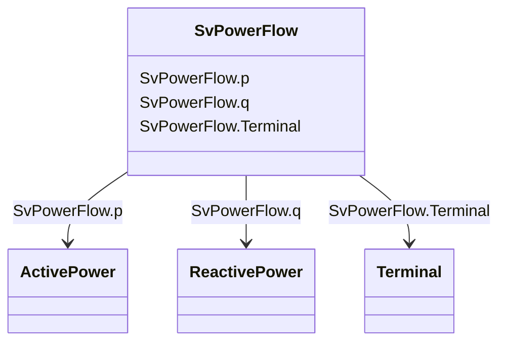

# SvPowerFlow

_State variable for power flow. Load convention is used for flow direction. This means flow out from the TopologicalNode into the equipment is positive._

**URI**: [cim:SvPowerFlow](http://iec.ch/TC57/CIM100#SvPowerFlow) 
**Type**: Class

<!-- no inheritance hierarchy -->

## Attributes

| Name | URI | Cardinality and Range | Description | Inheritance |
| ---  | --- | --- | --- | --- |
| p | [cim:SvPowerFlow.p](http://iec.ch/TC57/CIM100#SvPowerFlow.p) | 1    [ActivePower](ActivePower.md)  | The active power flow | direct |
| q | [cim:SvPowerFlow.q](http://iec.ch/TC57/CIM100#SvPowerFlow.q) | 1    [ReactivePower](ReactivePower.md)  | The reactive power flow | direct |
| Terminal | [cim:SvPowerFlow.Terminal](http://iec.ch/TC57/CIM100#SvPowerFlow.Terminal) | 1    [Terminal](Terminal.md)  | The terminal associated with the power flow state variable | direct |

## Usages

| used by | used in | type | used |
| ---  | --- | --- | --- |
| [Terminal](Terminal.md) | SvPowerFlow | range | [SvPowerFlow](SvPowerFlow.md) |

## Identifier and Mapping Information

### Schema Source

* from schema: http://iec.ch/TC57/ns/CIM/StateVariables-EU#Package_StateVariablesProfile

## Mappings

| Mapping Type | Mapped Value |
| ---  | ---  |
| self | cim:SvPowerFlow |
| native | this:SvPowerFlow |

