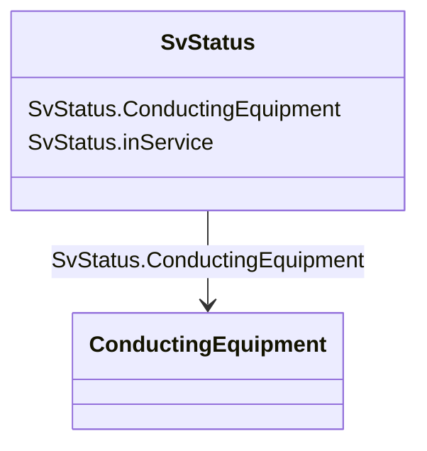

# SvStatus

_State variable for status._

**URI**: [cim:SvStatus](http://iec.ch/TC57/CIM100#SvStatus) 
**Type**: Class

<!-- no inheritance hierarchy -->

## Attributes

| Name | URI | Cardinality and Range | Description | Inheritance |
| ---  | --- | --- | --- | --- |
| ConductingEquipment | [cim:SvStatus.ConductingEquipment](http://iec.ch/TC57/CIM100#SvStatus.ConductingEquipment) | 1..1    [ConductingEquipment](ConductingEquipment.md)  | The conducting equipment associated with the status state variable | direct |
| inService | [cim:SvStatus.inService](http://iec.ch/TC57/CIM100#SvStatus.inService) | 1..1    boolean  | The in service status as a result of topology processing | direct |

## Usages

| used by | used in | type | used |
| ---  | --- | --- | --- |
| [ACDCConverter](ACDCConverter.md) | SvStatus | range | [SvStatus](SvStatus.md) |
| [CsConverter](CsConverter.md) | SvStatus | range | [SvStatus](SvStatus.md) |
| [ConductingEquipment](ConductingEquipment.md) | SvStatus | range | [SvStatus](SvStatus.md) |
| [Switch](Switch.md) | SvStatus | range | [SvStatus](SvStatus.md) |
| [VsConverter](VsConverter.md) | SvStatus | range | [SvStatus](SvStatus.md) |

## Identifier and Mapping Information

### Schema Source

* from schema: http://iec.ch/TC57/ns/CIM/StateVariables-EU#Package_StateVariablesProfile

## Mappings

| Mapping Type | Mapped Value |
| ---  | ---  |
| self | cim:SvStatus |
| native | this:SvStatus |

