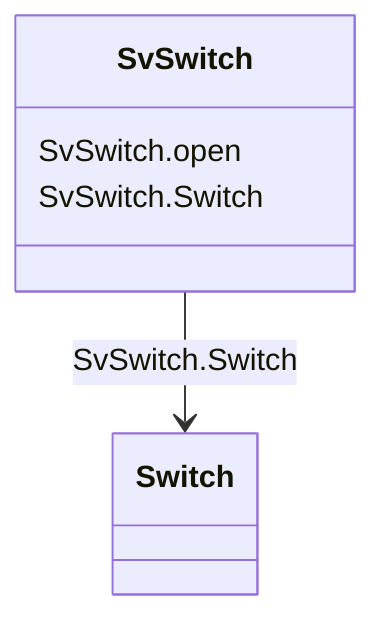

# SvSwitch

_State variable for switch._

**URI**: [cim:SvSwitch](http://iec.ch/TC57/CIM100#SvSwitch) 
**Type**: Class

<!-- no inheritance hierarchy -->

## Attributes

| Name | URI | Cardinality and Range | Description | Inheritance |
| ---  | --- | --- | --- | --- |
| open | [cim:SvSwitch.open](http://iec.ch/TC57/CIM100#SvSwitch.open) | 1..1    boolean  | The attribute tells if the computed state of the switch is considered open | direct |
| Switch | [cim:SvSwitch.Switch](http://iec.ch/TC57/CIM100#SvSwitch.Switch) | 1..1    [Switch](Switch.md)  | The switch associated with the switch state | direct |

## Usages

| used by | used in | type | used |
| ---  | --- | --- | --- |
| [Switch](Switch.md) | SvSwitch | range | [SvSwitch](SvSwitch.md) |

## Identifier and Mapping Information

### Schema Source

* from schema: http://iec.ch/TC57/ns/CIM/StateVariables-EU#Package_StateVariablesProfile

## Mappings

| Mapping Type | Mapped Value |
| ---  | ---  |
| self | cim:SvSwitch |
| native | this:SvSwitch |

