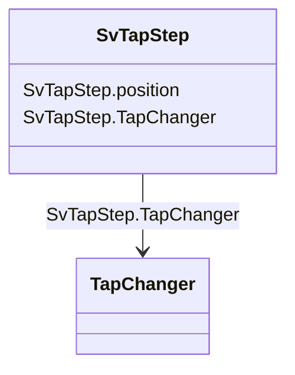

# SvTapStep

_State variable for transformer tap step._

**URI**: [cim:SvTapStep](http://iec.ch/TC57/CIM100#SvTapStep) 
**Type**: Class

<!-- no inheritance hierarchy -->

## Attributes

| Name | URI | Cardinality and Range | Description | Inheritance |
| ---  | --- | --- | --- | --- |
| position | [cim:SvTapStep.position](http://iec.ch/TC57/CIM100#SvTapStep.position) | 1..1    float  | The floating point tap position | direct |
| TapChanger | [cim:SvTapStep.TapChanger](http://iec.ch/TC57/CIM100#SvTapStep.TapChanger) | 1..1    [TapChanger](TapChanger.md)  | The tap changer associated with the tap step state | direct |

## Usages

| used by | used in | type | used |
| ---  | --- | --- | --- |
| [TapChanger](TapChanger.md) | SvTapStep | range | [SvTapStep](SvTapStep.md) |

## Identifier and Mapping Information

### Schema Source

* from schema: http://iec.ch/TC57/ns/CIM/StateVariables-EU#Package_StateVariablesProfile

## Mappings

| Mapping Type | Mapped Value |
| ---  | ---  |
| self | cim:SvTapStep |
| native | this:SvTapStep |

