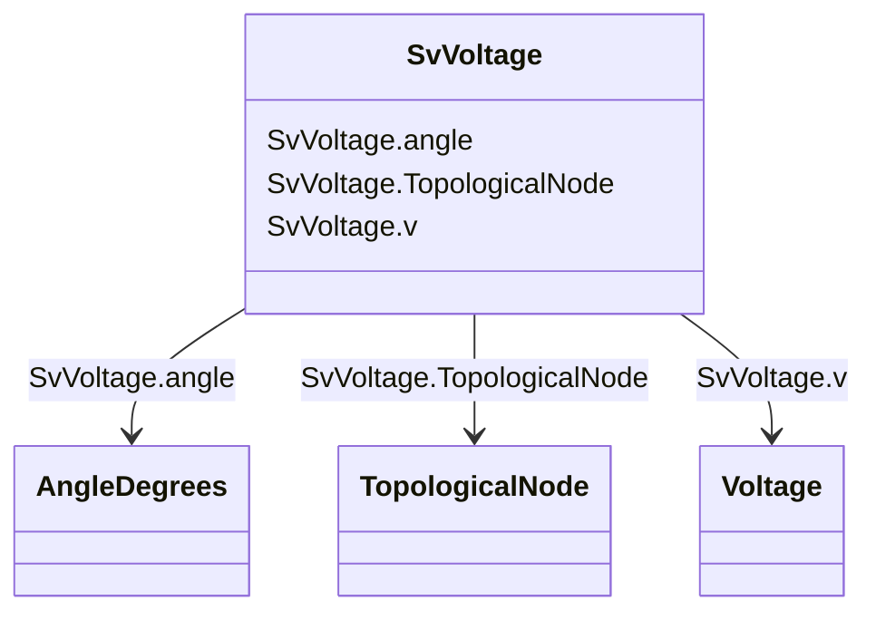

# SvVoltage

_State variable for voltage._

**URI**: [cim:SvVoltage](http://iec.ch/TC57/CIM100#SvVoltage) 
**Type**: Class

<!-- no inheritance hierarchy -->

## Attributes

| Name | URI | Cardinality and Range | Description | Inheritance |
| ---  | --- | --- | --- | --- |
| angle | [cim:SvVoltage.angle](http://iec.ch/TC57/CIM100#SvVoltage.angle) | 1..1    [AngleDegrees](AngleDegrees.md)  | The voltage angle of the topological node complex voltage with respect to sys... | direct |
| v | [cim:SvVoltage.v](http://iec.ch/TC57/CIM100#SvVoltage.v) | 1..1    [Voltage](Voltage.md)  | The voltage magnitude at the topological node | direct |
| TopologicalNode | [cim:SvVoltage.TopologicalNode](http://iec.ch/TC57/CIM100#SvVoltage.TopologicalNode) | 1..1    [TopologicalNode](TopologicalNode.md)  | The topological node associated with the voltage state | direct |

## Usages

| used by | used in | type | used |
| ---  | --- | --- | --- |
| [TopologicalNode](TopologicalNode.md) | SvVoltage | range | [SvVoltage](SvVoltage.md) |

## Identifier and Mapping Information

### Schema Source

* from schema: http://iec.ch/TC57/ns/CIM/StateVariables-EU#Package_StateVariablesProfile

## Mappings

| Mapping Type | Mapped Value |
| ---  | ---  |
| self | cim:SvVoltage |
| native | this:SvVoltage |

