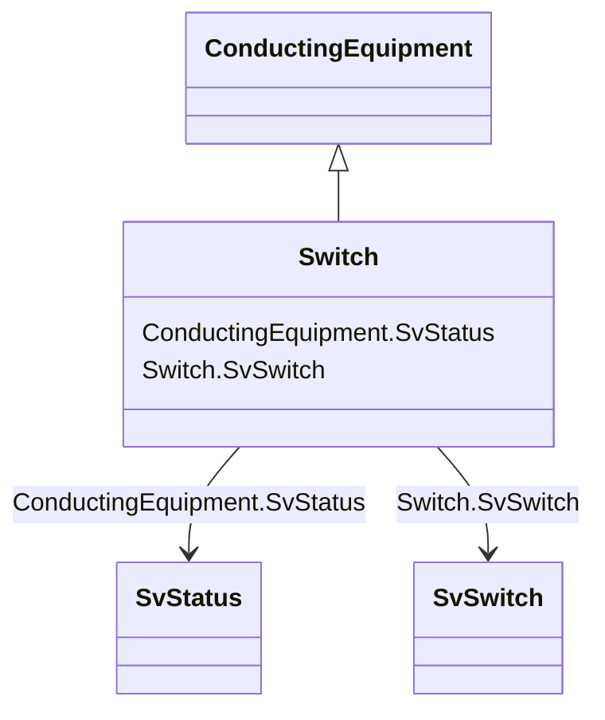

# Switch

_A generic device designed to close, or open, or both, one or more electric circuits.  All switches are two terminal devices including grounding switches. The ACDCTerminal.connected at the two sides of the switch shall not be considered for assessing switch connectivity, i.e. only Switch.open, .normalOpen and .locked are relevant._

**URI**: [cim:Switch](http://iec.ch/TC57/CIM100#Switch) 
**Type**: Class

## Inheritance
* [ConductingEquipment](ConductingEquipment.md)
    * **Switch**

## Attributes

| Name | URI | Cardinality and Range | Description | Inheritance |
| ---  | --- | --- | --- | --- |
| SvSwitch | [cim:Switch.SvSwitch](http://iec.ch/TC57/CIM100#Switch.SvSwitch) | *    [SvSwitch](SvSwitch.md)  | The switch state associated with the switch | direct |
| SvStatus | [cim:ConductingEquipment.SvStatus](http://iec.ch/TC57/CIM100#ConductingEquipment.SvStatus) | 0..1    [SvStatus](SvStatus.md)  | The status state variable associated with this conducting equipment | [ConductingEquipment](ConductingEquipment.md) |

## Usages

| used by | used in | type | used |
| ---  | --- | --- | --- |
| [SvSwitch](SvSwitch.md) | Switch | range | [Switch](Switch.md) |

## Identifier and Mapping Information

### Schema Source

* from schema: http://iec.ch/TC57/ns/CIM/StateVariables-EU#Package_StateVariablesProfile

## Mappings

| Mapping Type | Mapped Value |
| ---  | ---  |
| self | cim:Switch |
| native | this:Switch |

