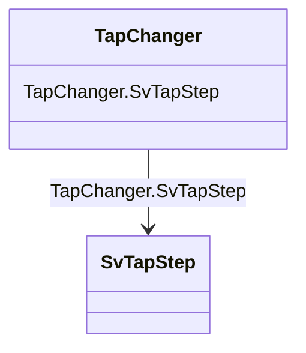

# TapChanger

_Mechanism for changing transformer winding tap positions._

**URI**: [cim:TapChanger](http://iec.ch/TC57/CIM100#TapChanger) 
**Type**: Class

<!-- no inheritance hierarchy -->

## Attributes

| Name | URI | Cardinality and Range | Description | Inheritance |
| ---  | --- | --- | --- | --- |
| SvTapStep | [cim:TapChanger.SvTapStep](http://iec.ch/TC57/CIM100#TapChanger.SvTapStep) | 0..1    [SvTapStep](SvTapStep.md)  | The tap step state associated with the tap changer | direct |

## Usages

| used by | used in | type | used |
| ---  | --- | --- | --- |
| [SvTapStep](SvTapStep.md) | TapChanger | range | [TapChanger](TapChanger.md) |

## Identifier and Mapping Information

### Schema Source

* from schema: http://iec.ch/TC57/ns/CIM/StateVariables-EU#Package_StateVariablesProfile

## Mappings

| Mapping Type | Mapped Value |
| ---  | ---  |
| self | cim:TapChanger |
| native | this:TapChanger |

