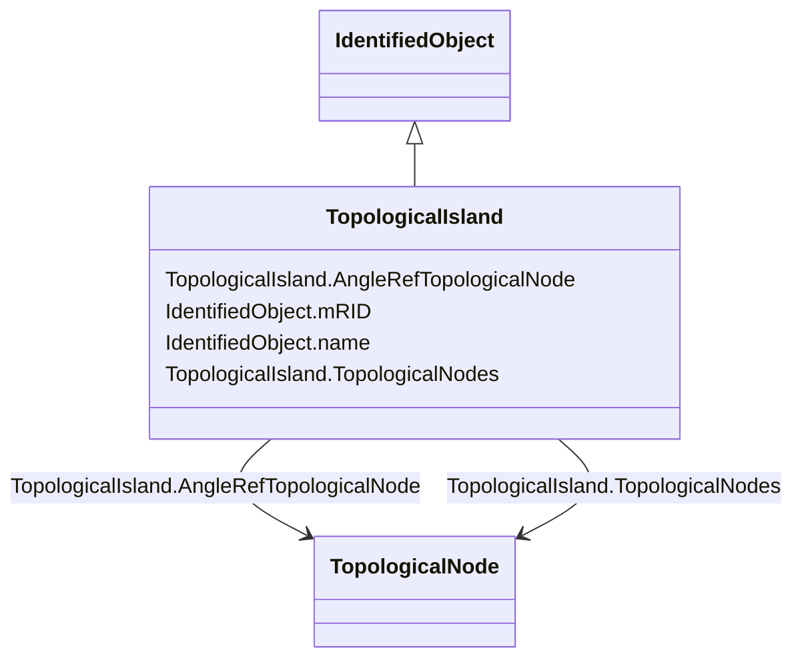

# TopologicalIsland

_An electrically connected subset of the network. Topological islands can change as the current network state changes, e.g. due to: _

_- disconnect switches or breakers changing state in a SCADA/EMS._

_- manual creation, change or deletion of topological nodes in a planning tool._

_Only energised TopologicalNode-s shall be part of the topological island._

**URI**: [cim:TopologicalIsland](http://iec.ch/TC57/CIM100#TopologicalIsland) 
**Type**: Class

## Inheritance
* [IdentifiedObject](IdentifiedObject.md)
    * **TopologicalIsland**

## Attributes

| Name | URI | Cardinality and Range | Description | Inheritance |
| ---  | --- | --- | --- | --- |
| AngleRefTopologicalNode | [cim:TopologicalIsland.AngleRefTopologicalNode](http://iec.ch/TC57/CIM100#TopologicalIsland.AngleRefTopologicalNode) | 1..1    [TopologicalNode](TopologicalNode.md)  | The angle reference for the island | direct |
| TopologicalNodes | [cim:TopologicalIsland.TopologicalNodes](http://iec.ch/TC57/CIM100#TopologicalIsland.TopologicalNodes) | 1..*    [TopologicalNode](TopologicalNode.md)  | A topological node belongs to a topological island | direct |
| mRID | [cim:IdentifiedObject.mRID](http://iec.ch/TC57/CIM100#IdentifiedObject.mRID) | 1..1    string  | Master resource identifier issued by a model authority | [IdentifiedObject](IdentifiedObject.md) |
| name | [cim:IdentifiedObject.name](http://iec.ch/TC57/CIM100#IdentifiedObject.name) | 1..1    string  | The name is any free human readable and possibly non unique text naming the o... | [IdentifiedObject](IdentifiedObject.md) |

## Usages

| used by | used in | type | used |
| ---  | --- | --- | --- |
| [TopologicalNode](TopologicalNode.md) | AngleRefTopologicalIsland | range | [TopologicalIsland](TopologicalIsland.md) |
| [TopologicalNode](TopologicalNode.md) | TopologicalIsland | range | [TopologicalIsland](TopologicalIsland.md) |

## Identifier and Mapping Information

### Schema Source

* from schema: http://iec.ch/TC57/ns/CIM/StateVariables-EU#Package_StateVariablesProfile

## Mappings

| Mapping Type | Mapped Value |
| ---  | ---  |
| self | cim:TopologicalIsland |
| native | this:TopologicalIsland |

