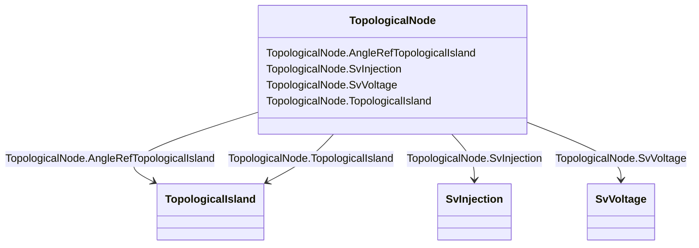

# TopologicalNode

_For a detailed substation model a topological node is a set of connectivity nodes that, in the current network state, are connected together through any type of closed switches, including  jumpers. Topological nodes change as the current network state changes (i.e., switches, breakers, etc. change state)._

_For a planning model, switch statuses are not used to form topological nodes. Instead they are manually created or deleted in a model builder tool. Topological nodes maintained this way are also called "busses"._

**URI**: [cim:TopologicalNode](http://iec.ch/TC57/CIM100#TopologicalNode) 
**Type**: Class

<!-- no inheritance hierarchy -->

## Attributes

| Name | URI | Cardinality and Range | Description | Inheritance |
| ---  | --- | --- | --- | --- |
| SvInjection | [cim:TopologicalNode.SvInjection](http://iec.ch/TC57/CIM100#TopologicalNode.SvInjection) | 0..1    [SvInjection](SvInjection.md)  | The injection flows state variables associated with the topological node | direct |
| SvVoltage | [cim:TopologicalNode.SvVoltage](http://iec.ch/TC57/CIM100#TopologicalNode.SvVoltage) | 0..1    [SvVoltage](SvVoltage.md)  | The state voltage associated with the topological node | direct |
| AngleRefTopologicalIsland | [cim:TopologicalNode.AngleRefTopologicalIsland](http://iec.ch/TC57/CIM100#TopologicalNode.AngleRefTopologicalIsland) | 0..1    [TopologicalIsland](TopologicalIsland.md)  | The island for which the node is an angle reference | direct |
| TopologicalIsland | [cim:TopologicalNode.TopologicalIsland](http://iec.ch/TC57/CIM100#TopologicalNode.TopologicalIsland) | 0..1    [TopologicalIsland](TopologicalIsland.md)  | A topological node belongs to a topological island | direct |

## Usages

| used by | used in | type | used |
| ---  | --- | --- | --- |
| [SvInjection](SvInjection.md) | TopologicalNode | range | [TopologicalNode](TopologicalNode.md) |
| [SvVoltage](SvVoltage.md) | TopologicalNode | range | [TopologicalNode](TopologicalNode.md) |
| [TopologicalIsland](TopologicalIsland.md) | AngleRefTopologicalNode | range | [TopologicalNode](TopologicalNode.md) |
| [TopologicalIsland](TopologicalIsland.md) | TopologicalNodes | range | [TopologicalNode](TopologicalNode.md) |

## Identifier and Mapping Information

### Schema Source

* from schema: http://iec.ch/TC57/ns/CIM/StateVariables-EU#Package_StateVariablesProfile

## Mappings

| Mapping Type | Mapped Value |
| ---  | ---  |
| self | cim:TopologicalNode |
| native | this:TopologicalNode |

