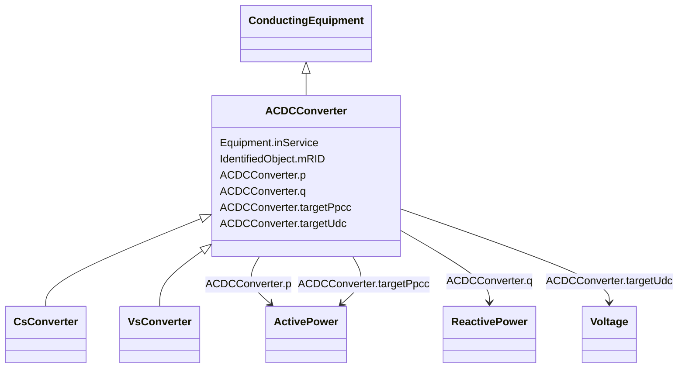

# ACDCConverter

_A unit with valves for three phases, together with unit control equipment, essential protective and switching devices, DC storage capacitors, phase reactors and auxiliaries, if any, used for conversion._

**URI**: [cim:ACDCConverter](http://iec.ch/TC57/CIM100#ACDCConverter) 
**Type**: Class

## Inheritance
* [IdentifiedObject](IdentifiedObject.md)
    * [PowerSystemResource](PowerSystemResource.md)
        * [Equipment](Equipment.md)
            * [ConductingEquipment](ConductingEquipment.md)
                * **ACDCConverter**
                    * [CsConverter](CsConverter.md)
                    * [VsConverter](VsConverter.md)

## Attributes

| Name | URI | Cardinality and Range | Description | Inheritance |
| ---  | --- | --- | --- | --- |
| p | [cim:ACDCConverter.p](http://iec.ch/TC57/CIM100#ACDCConverter.p) | 1..1    [ActivePower](ActivePower.md)  | Active power at the point of common coupling | direct |
| q | [cim:ACDCConverter.q](http://iec.ch/TC57/CIM100#ACDCConverter.q) | 1..1    [ReactivePower](ReactivePower.md)  | Reactive power at the point of common coupling | direct |
| targetPpcc | [cim:ACDCConverter.targetPpcc](http://iec.ch/TC57/CIM100#ACDCConverter.targetPpcc) | 0..1    [ActivePower](ActivePower.md)  | Real power injection target in AC grid, at point of common coupling | direct |
| targetUdc | [cim:ACDCConverter.targetUdc](http://iec.ch/TC57/CIM100#ACDCConverter.targetUdc) | 0..1    [Voltage](Voltage.md)  | Target value for DC voltage magnitude | direct |
| inService | [cim:Equipment.inService](http://iec.ch/TC57/CIM100#Equipment.inService) | 1..1    boolean  | Specifies the availability of the equipment | [Equipment](Equipment.md) |
| mRID | [cim:IdentifiedObject.mRID](http://iec.ch/TC57/CIM100#IdentifiedObject.mRID) | 1..1    string  | Master resource identifier issued by a model authority | [IdentifiedObject](IdentifiedObject.md) |

## Identifier and Mapping Information

### Schema Source

* from schema: http://iec.ch/TC57/ns/CIM/SteadyStateHypothesis-EU#Package_SteadyStateHypothesisProfile

## Mappings

| Mapping Type | Mapped Value |
| ---  | ---  |
| self | cim:ACDCConverter |
| native | this:ACDCConverter |

