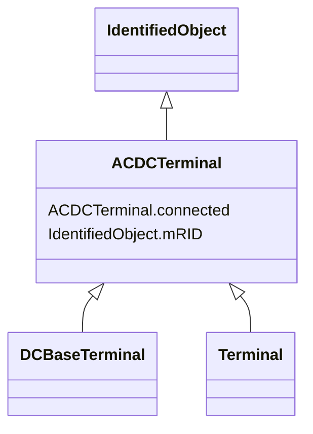

# ACDCTerminal

_An electrical connection point (AC or DC) to a piece of conducting equipment. Terminals are connected at physical connection points called connectivity nodes._

**URI**: [cim:ACDCTerminal](http://iec.ch/TC57/CIM100#ACDCTerminal) 
**Type**: Class

## Inheritance
* [IdentifiedObject](IdentifiedObject.md)
    * **ACDCTerminal**
        * [DCBaseTerminal](DCBaseTerminal.md)
        * [Terminal](Terminal.md)

## Attributes

| Name | URI | Cardinality and Range | Description | Inheritance |
| ---  | --- | --- | --- | --- |
| connected | [cim:ACDCTerminal.connected](http://iec.ch/TC57/CIM100#ACDCTerminal.connected) | 1    boolean  | The connected status is related to a bus-branch model and the topological nod... | direct |
| mRID | [cim:IdentifiedObject.mRID](http://iec.ch/TC57/CIM100#IdentifiedObject.mRID) | 1    string  | Master resource identifier issued by a model authority | [IdentifiedObject](IdentifiedObject.md) |

## Identifier and Mapping Information

### Schema Source

* from schema: http://iec.ch/TC57/ns/CIM/SteadyStateHypothesis-EU#Package_SteadyStateHypothesisProfile

## Mappings

| Mapping Type | Mapped Value |
| ---  | ---  |
| self | cim:ACDCTerminal |
| native | this:ACDCTerminal |

