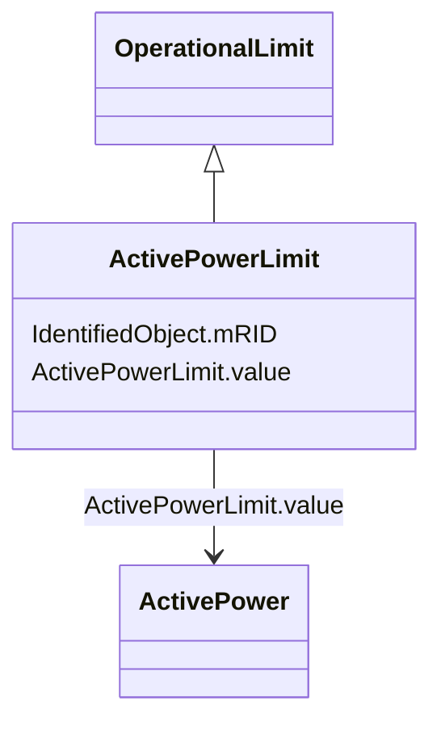

# ActivePowerLimit

_Limit on active power flow._

**URI**: [cim:ActivePowerLimit](http://iec.ch/TC57/CIM100#ActivePowerLimit) 
**Type**: Class

## Inheritance
* [IdentifiedObject](IdentifiedObject.md)
    * [OperationalLimit](OperationalLimit.md)
        * **ActivePowerLimit**

## Attributes

| Name | URI | Cardinality and Range | Description | Inheritance |
| ---  | --- | --- | --- | --- |
| value | [cim:ActivePowerLimit.value](http://iec.ch/TC57/CIM100#ActivePowerLimit.value) | 1..1    [ActivePower](ActivePower.md)  | Value of active power limit | direct |
| mRID | [cim:IdentifiedObject.mRID](http://iec.ch/TC57/CIM100#IdentifiedObject.mRID) | 1..1    string  | Master resource identifier issued by a model authority | [IdentifiedObject](IdentifiedObject.md) |

## Identifier and Mapping Information

### Schema Source

* from schema: http://iec.ch/TC57/ns/CIM/SteadyStateHypothesis-EU#Package_SteadyStateHypothesisProfile

## Mappings

| Mapping Type | Mapped Value |
| ---  | ---  |
| self | cim:ActivePowerLimit |
| native | this:ActivePowerLimit |

