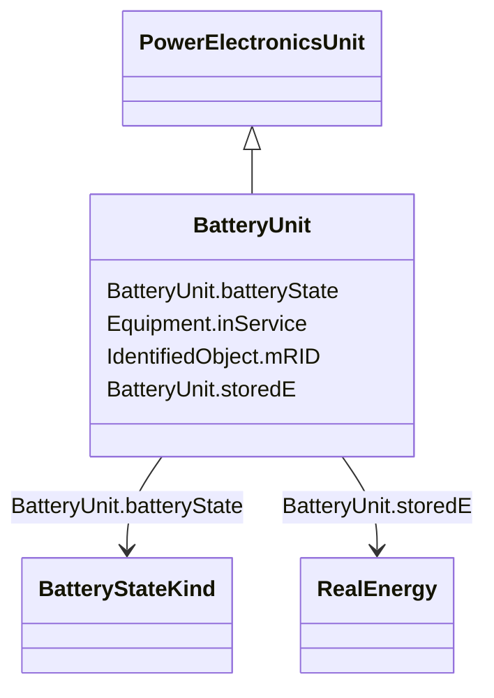

# BatteryUnit

_An electrochemical energy storage device._

**URI**: [cim:BatteryUnit](http://iec.ch/TC57/CIM100#BatteryUnit) 
**Type**: Class

## Inheritance
* [IdentifiedObject](IdentifiedObject.md)
    * [PowerSystemResource](PowerSystemResource.md)
        * [Equipment](Equipment.md)
            * [PowerElectronicsUnit](PowerElectronicsUnit.md)
                * **BatteryUnit**

## Attributes

| Name | URI | Cardinality and Range | Description | Inheritance |
| ---  | --- | --- | --- | --- |
| batteryState | [cim:BatteryUnit.batteryState](http://iec.ch/TC57/CIM100#BatteryUnit.batteryState) | 1..1    [BatteryStateKind](BatteryStateKind.md)  | The current state of the battery (charging, full, etc | direct |
| storedE | [cim:BatteryUnit.storedE](http://iec.ch/TC57/CIM100#BatteryUnit.storedE) | 1..1    [RealEnergy](RealEnergy.md)  | Amount of energy currently stored | direct |
| inService | [cim:Equipment.inService](http://iec.ch/TC57/CIM100#Equipment.inService) | 1..1    boolean  | Specifies the availability of the equipment | [Equipment](Equipment.md) |
| mRID | [cim:IdentifiedObject.mRID](http://iec.ch/TC57/CIM100#IdentifiedObject.mRID) | 1..1    string  | Master resource identifier issued by a model authority | [IdentifiedObject](IdentifiedObject.md) |

## Identifier and Mapping Information

### Schema Source

* from schema: http://iec.ch/TC57/ns/CIM/SteadyStateHypothesis-EU#Package_SteadyStateHypothesisProfile

## Mappings

| Mapping Type | Mapped Value |
| ---  | ---  |
| self | cim:BatteryUnit |
| native | this:BatteryUnit |

