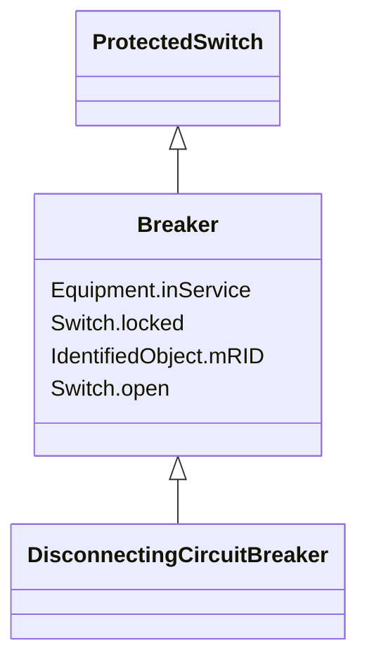

# Breaker

_A mechanical switching device capable of making, carrying, and breaking currents under normal circuit conditions and also making, carrying for a specified time, and breaking currents under specified abnormal circuit conditions e.g.  those of short circuit._

**URI**: [cim:Breaker](http://iec.ch/TC57/CIM100#Breaker) 
**Type**: Class

## Inheritance
* [IdentifiedObject](IdentifiedObject.md)
    * [PowerSystemResource](PowerSystemResource.md)
        * [Equipment](Equipment.md)
            * [ConductingEquipment](ConductingEquipment.md)
                * [Switch](Switch.md)
                    * [ProtectedSwitch](ProtectedSwitch.md)
                        * **Breaker**
                            * [DisconnectingCircuitBreaker](DisconnectingCircuitBreaker.md)

## Attributes

| Name | URI | Cardinality and Range | Description | Inheritance |
| ---  | --- | --- | --- | --- |
| open | [cim:Switch.open](http://iec.ch/TC57/CIM100#Switch.open) | 1    boolean  | The attribute tells if the switch is considered open when used as input to to... | [Switch](Switch.md) |
| locked | [cim:Switch.locked](http://iec.ch/TC57/CIM100#Switch.locked) | 1    boolean  | If true, the switch is locked | [Switch](Switch.md) |
| inService | [cim:Equipment.inService](http://iec.ch/TC57/CIM100#Equipment.inService) | 1    boolean  | Specifies the availability of the equipment | [Equipment](Equipment.md) |
| mRID | [cim:IdentifiedObject.mRID](http://iec.ch/TC57/CIM100#IdentifiedObject.mRID) | 1    string  | Master resource identifier issued by a model authority | [IdentifiedObject](IdentifiedObject.md) |

## Identifier and Mapping Information

### Schema Source

* from schema: http://iec.ch/TC57/ns/CIM/SteadyStateHypothesis-EU#Package_SteadyStateHypothesisProfile

## Mappings

| Mapping Type | Mapped Value |
| ---  | ---  |
| self | cim:Breaker |
| native | this:Breaker |

