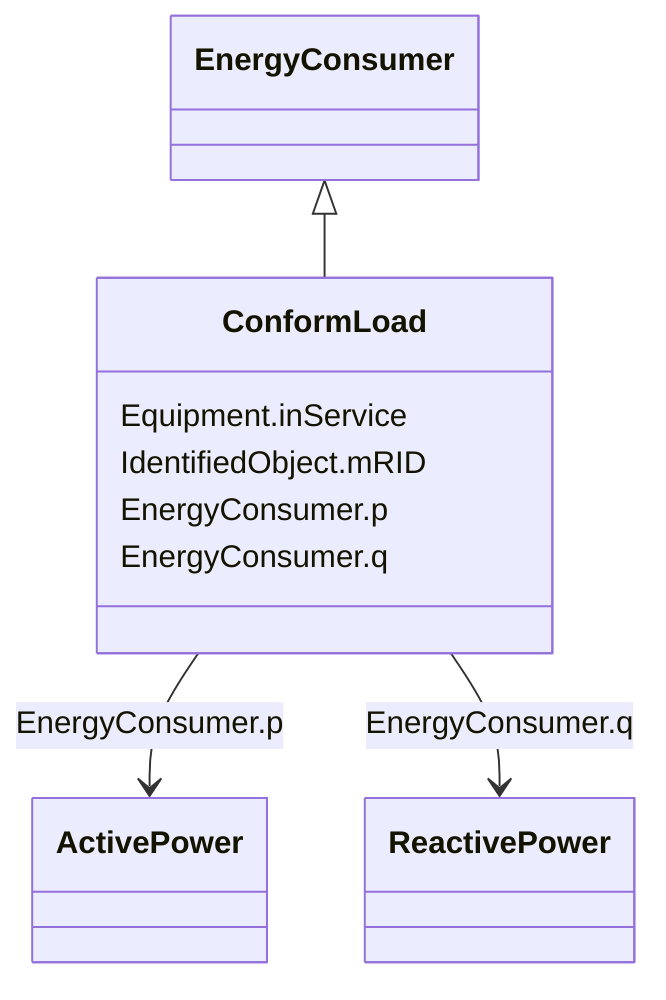

# ConformLoad

_ConformLoad represent loads that follow a daily load change pattern where the pattern can be used to scale the load with a system load._

**URI**: [cim:ConformLoad](http://iec.ch/TC57/CIM100#ConformLoad) 
**Type**: Class

## Inheritance
* [IdentifiedObject](IdentifiedObject.md)
    * [PowerSystemResource](PowerSystemResource.md)
        * [Equipment](Equipment.md)
            * [ConductingEquipment](ConductingEquipment.md)
                * [EnergyConnection](EnergyConnection.md)
                    * [EnergyConsumer](EnergyConsumer.md)
                        * **ConformLoad**

## Attributes

| Name | URI | Cardinality and Range | Description | Inheritance |
| ---  | --- | --- | --- | --- |
| p | [cim:EnergyConsumer.p](http://iec.ch/TC57/CIM100#EnergyConsumer.p) | 1    [ActivePower](ActivePower.md)  | Active power of the load | [EnergyConsumer](EnergyConsumer.md) |
| q | [cim:EnergyConsumer.q](http://iec.ch/TC57/CIM100#EnergyConsumer.q) | 1    [ReactivePower](ReactivePower.md)  | Reactive power of the load | [EnergyConsumer](EnergyConsumer.md) |
| inService | [cim:Equipment.inService](http://iec.ch/TC57/CIM100#Equipment.inService) | 1    boolean  | Specifies the availability of the equipment | [Equipment](Equipment.md) |
| mRID | [cim:IdentifiedObject.mRID](http://iec.ch/TC57/CIM100#IdentifiedObject.mRID) | 1    string  | Master resource identifier issued by a model authority | [IdentifiedObject](IdentifiedObject.md) |

## Identifier and Mapping Information

### Schema Source

* from schema: http://iec.ch/TC57/ns/CIM/SteadyStateHypothesis-EU#Package_SteadyStateHypothesisProfile

## Mappings

| Mapping Type | Mapped Value |
| ---  | ---  |
| self | cim:ConformLoad |
| native | this:ConformLoad |

