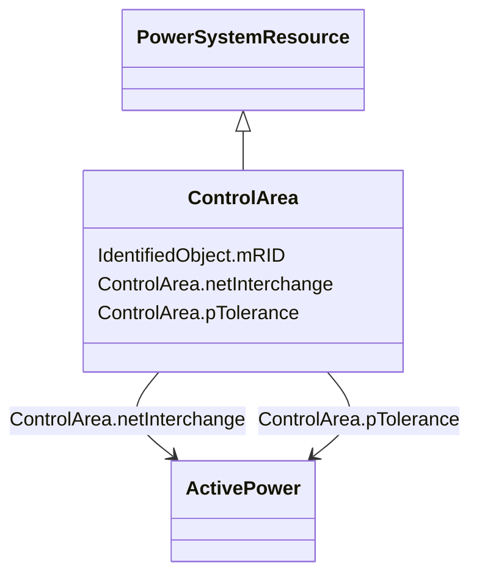

# ControlArea

_A control area is a grouping of generating units and/or loads and a cutset of tie lines (as terminals) which may be used for a variety of purposes including automatic generation control, power flow solution area interchange control specification, and input to load forecasting. All generation and load within the area defined by the terminals on the border are considered in the area interchange control. Note that any number of overlapping control area specifications can be superimposed on the physical model. The following general principles apply to ControlArea:_

_1.  The control area orientation for net interchange is positive for an import, negative for an export._

_2.  The control area net interchange is determined by summing flows in Terminals. The Terminals are identified by creating a set of TieFlow objects associated with a ControlArea object. Each TieFlow object identifies one Terminal._

_3.  In a single network model, a tie between two control areas must be modelled in both control area specifications, such that the two representations of the tie flow sum to zero._

_4.  The normal orientation of Terminal flow is positive for flow into the conducting equipment that owns the Terminal. (i.e. flow from a bus into a device is positive.) However, the orientation of each flow in the control area specification must align with the control area convention, i.e. import is positive. If the orientation of the Terminal flow referenced by a TieFlow is positive into the control area, then this is confirmed by setting TieFlow.positiveFlowIn flag TRUE. If not, the orientation must be reversed by setting the TieFlow.positiveFlowIn flag FALSE._

**URI**: [cim:ControlArea](http://iec.ch/TC57/CIM100#ControlArea) 
**Type**: Class

## Inheritance
* [IdentifiedObject](IdentifiedObject.md)
    * [PowerSystemResource](PowerSystemResource.md)
        * **ControlArea**

## Attributes

| Name | URI | Cardinality and Range | Description | Inheritance |
| ---  | --- | --- | --- | --- |
| netInterchange | [cim:ControlArea.netInterchange](http://iec.ch/TC57/CIM100#ControlArea.netInterchange) | 1    [ActivePower](ActivePower.md)  | The specified positive net interchange into the control area, i | direct |
| pTolerance | [cim:ControlArea.pTolerance](http://iec.ch/TC57/CIM100#ControlArea.pTolerance) | 0..1    [ActivePower](ActivePower.md)  | Active power net interchange tolerance | direct |
| mRID | [cim:IdentifiedObject.mRID](http://iec.ch/TC57/CIM100#IdentifiedObject.mRID) | 1    string  | Master resource identifier issued by a model authority | [IdentifiedObject](IdentifiedObject.md) |

## Identifier and Mapping Information

### Schema Source

* from schema: http://iec.ch/TC57/ns/CIM/SteadyStateHypothesis-EU#Package_SteadyStateHypothesisProfile

## Mappings

| Mapping Type | Mapped Value |
| ---  | ---  |
| self | cim:ControlArea |
| native | this:ControlArea |

