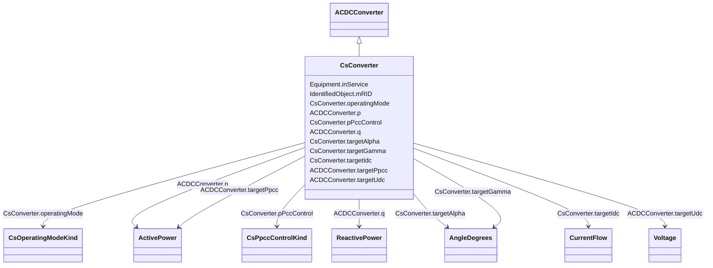

# CsConverter

_DC side of the current source converter (CSC)._

_The firing angle controls the dc voltage at the converter, both for rectifier and inverter. The difference between the dc voltages of the rectifier and inverter determines the dc current. The extinction angle is used to limit the dc voltage at the inverter, if needed, and is not used in active power control. The firing angle, transformer tap position and number of connected filters are the primary means to control a current source dc line. Higher level controls are built on top, e.g. dc voltage, dc current and active power. From a steady state perspective it is sufficient to specify the wanted active power transfer (ACDCConverter.targetPpcc) and the control functions will set the dc voltage, dc current, firing angle, transformer tap position and number of connected filters to meet this. Therefore attributes targetAlpha and targetGamma are not applicable in this case._

_The reactive power consumed by the converter is a function of the firing angle, transformer tap position and number of connected filter, which can be approximated with half of the active power. The losses is a function of the dc voltage and dc current._

_The attributes minAlpha and maxAlpha define the range of firing angles for rectifier operation between which no discrete tap changer action takes place. The range is typically 10-18 degrees._

_The attributes minGamma and maxGamma define the range of extinction angles for inverter operation between which no discrete tap changer action takes place. The range is typically 17-20 degrees._

**URI**: [cim:CsConverter](http://iec.ch/TC57/CIM100#CsConverter) 
**Type**: Class

## Inheritance
* [IdentifiedObject](IdentifiedObject.md)
    * [PowerSystemResource](PowerSystemResource.md)
        * [Equipment](Equipment.md)
            * [ConductingEquipment](ConductingEquipment.md)
                * [ACDCConverter](ACDCConverter.md)
                    * **CsConverter**

## Attributes

| Name | URI | Cardinality and Range | Description | Inheritance |
| ---  | --- | --- | --- | --- |
| operatingMode | [cim:CsConverter.operatingMode](http://iec.ch/TC57/CIM100#CsConverter.operatingMode) | 1    [CsOperatingModeKind](CsOperatingModeKind.md)  | Indicates whether the DC pole is operating as an inverter or as a rectifier | direct |
| pPccControl | [cim:CsConverter.pPccControl](http://iec.ch/TC57/CIM100#CsConverter.pPccControl) | 1    [CsPpccControlKind](CsPpccControlKind.md)  | Kind of active power control | direct |
| targetAlpha | [cim:CsConverter.targetAlpha](http://iec.ch/TC57/CIM100#CsConverter.targetAlpha) | 0..1    [AngleDegrees](AngleDegrees.md)  | Target firing angle | direct |
| targetGamma | [cim:CsConverter.targetGamma](http://iec.ch/TC57/CIM100#CsConverter.targetGamma) | 0..1    [AngleDegrees](AngleDegrees.md)  | Target extinction angle | direct |
| targetIdc | [cim:CsConverter.targetIdc](http://iec.ch/TC57/CIM100#CsConverter.targetIdc) | 0..1    [CurrentFlow](CurrentFlow.md)  | DC current target value | direct |
| p | [cim:ACDCConverter.p](http://iec.ch/TC57/CIM100#ACDCConverter.p) | 1    [ActivePower](ActivePower.md)  | Active power at the point of common coupling | [ACDCConverter](ACDCConverter.md) |
| q | [cim:ACDCConverter.q](http://iec.ch/TC57/CIM100#ACDCConverter.q) | 1    [ReactivePower](ReactivePower.md)  | Reactive power at the point of common coupling | [ACDCConverter](ACDCConverter.md) |
| targetPpcc | [cim:ACDCConverter.targetPpcc](http://iec.ch/TC57/CIM100#ACDCConverter.targetPpcc) | 0..1    [ActivePower](ActivePower.md)  | Real power injection target in AC grid, at point of common coupling | [ACDCConverter](ACDCConverter.md) |
| targetUdc | [cim:ACDCConverter.targetUdc](http://iec.ch/TC57/CIM100#ACDCConverter.targetUdc) | 0..1    [Voltage](Voltage.md)  | Target value for DC voltage magnitude | [ACDCConverter](ACDCConverter.md) |
| inService | [cim:Equipment.inService](http://iec.ch/TC57/CIM100#Equipment.inService) | 1    boolean  | Specifies the availability of the equipment | [Equipment](Equipment.md) |
| mRID | [cim:IdentifiedObject.mRID](http://iec.ch/TC57/CIM100#IdentifiedObject.mRID) | 1    string  | Master resource identifier issued by a model authority | [IdentifiedObject](IdentifiedObject.md) |

## Identifier and Mapping Information

### Schema Source

* from schema: http://iec.ch/TC57/ns/CIM/SteadyStateHypothesis-EU#Package_SteadyStateHypothesisProfile

## Mappings

| Mapping Type | Mapped Value |
| ---  | ---  |
| self | cim:CsConverter |
| native | this:CsConverter |

