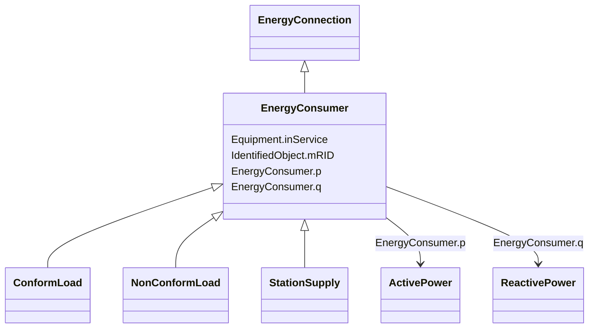

# EnergyConsumer

_Generic user of energy - a  point of consumption on the power system model._

_EnergyConsumer.pfixed, .qfixed, .pfixedPct and .qfixedPct have meaning only if there is no LoadResponseCharacteristic associated with EnergyConsumer or if LoadResponseCharacteristic.exponentModel is set to False._

**URI**: [cim:EnergyConsumer](http://iec.ch/TC57/CIM100#EnergyConsumer) 
**Type**: Class

## Inheritance
* [IdentifiedObject](IdentifiedObject.md)
    * [PowerSystemResource](PowerSystemResource.md)
        * [Equipment](Equipment.md)
            * [ConductingEquipment](ConductingEquipment.md)
                * [EnergyConnection](EnergyConnection.md)
                    * **EnergyConsumer**
                        * [ConformLoad](ConformLoad.md)
                        * [NonConformLoad](NonConformLoad.md)
                        * [StationSupply](StationSupply.md)

## Attributes

| Name | URI | Cardinality and Range | Description | Inheritance |
| ---  | --- | --- | --- | --- |
| p | [cim:EnergyConsumer.p](http://iec.ch/TC57/CIM100#EnergyConsumer.p) | 1    [ActivePower](ActivePower.md)  | Active power of the load | direct |
| q | [cim:EnergyConsumer.q](http://iec.ch/TC57/CIM100#EnergyConsumer.q) | 1    [ReactivePower](ReactivePower.md)  | Reactive power of the load | direct |
| inService | [cim:Equipment.inService](http://iec.ch/TC57/CIM100#Equipment.inService) | 1    boolean  | Specifies the availability of the equipment | [Equipment](Equipment.md) |
| mRID | [cim:IdentifiedObject.mRID](http://iec.ch/TC57/CIM100#IdentifiedObject.mRID) | 1    string  | Master resource identifier issued by a model authority | [IdentifiedObject](IdentifiedObject.md) |

## Identifier and Mapping Information

### Schema Source

* from schema: http://iec.ch/TC57/ns/CIM/SteadyStateHypothesis-EU#Package_SteadyStateHypothesisProfile

## Mappings

| Mapping Type | Mapped Value |
| ---  | ---  |
| self | cim:EnergyConsumer |
| native | this:EnergyConsumer |

