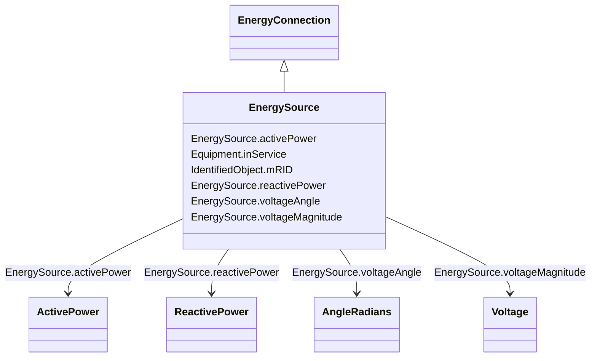

# EnergySource

_A generic equivalent for an energy supplier on a transmission or distribution voltage level._

**URI**: [cim:EnergySource](http://iec.ch/TC57/CIM100#EnergySource) 
**Type**: Class

## Inheritance
* [IdentifiedObject](IdentifiedObject.md)
    * [PowerSystemResource](PowerSystemResource.md)
        * [Equipment](Equipment.md)
            * [ConductingEquipment](ConductingEquipment.md)
                * [EnergyConnection](EnergyConnection.md)
                    * **EnergySource**

## Attributes

| Name | URI | Cardinality and Range | Description | Inheritance |
| ---  | --- | --- | --- | --- |
| activePower | [cim:EnergySource.activePower](http://iec.ch/TC57/CIM100#EnergySource.activePower) | 1    [ActivePower](ActivePower.md)  | High voltage source active injection | direct |
| reactivePower | [cim:EnergySource.reactivePower](http://iec.ch/TC57/CIM100#EnergySource.reactivePower) | 1    [ReactivePower](ReactivePower.md)  | High voltage source reactive injection | direct |
| voltageAngle | [cim:EnergySource.voltageAngle](http://iec.ch/TC57/CIM100#EnergySource.voltageAngle) | 0..1    [AngleRadians](AngleRadians.md)  | Phase angle of a-phase open circuit used when voltage characteristics need to... | direct |
| voltageMagnitude | [cim:EnergySource.voltageMagnitude](http://iec.ch/TC57/CIM100#EnergySource.voltageMagnitude) | 0..1    [Voltage](Voltage.md)  | Phase-to-phase open circuit voltage magnitude used when voltage characteristi... | direct |
| inService | [cim:Equipment.inService](http://iec.ch/TC57/CIM100#Equipment.inService) | 1    boolean  | Specifies the availability of the equipment | [Equipment](Equipment.md) |
| mRID | [cim:IdentifiedObject.mRID](http://iec.ch/TC57/CIM100#IdentifiedObject.mRID) | 1    string  | Master resource identifier issued by a model authority | [IdentifiedObject](IdentifiedObject.md) |

## Identifier and Mapping Information

### Schema Source

* from schema: http://iec.ch/TC57/ns/CIM/SteadyStateHypothesis-EU#Package_SteadyStateHypothesisProfile

## Mappings

| Mapping Type | Mapped Value |
| ---  | ---  |
| self | cim:EnergySource |
| native | this:EnergySource |

