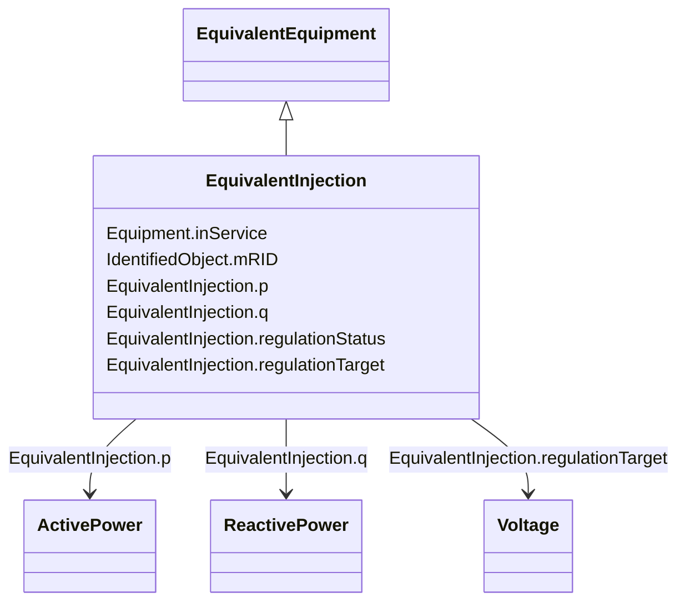

# EquivalentInjection

_This class represents equivalent injections (generation or load).  Voltage regulation is allowed only at the point of connection._

**URI**: [cim:EquivalentInjection](http://iec.ch/TC57/CIM100#EquivalentInjection) 
**Type**: Class

## Inheritance
* [IdentifiedObject](IdentifiedObject.md)
    * [PowerSystemResource](PowerSystemResource.md)
        * [Equipment](Equipment.md)
            * [ConductingEquipment](ConductingEquipment.md)
                * [EquivalentEquipment](EquivalentEquipment.md)
                    * **EquivalentInjection**

## Attributes

| Name | URI | Cardinality and Range | Description | Inheritance |
| ---  | --- | --- | --- | --- |
| regulationStatus | [cim:EquivalentInjection.regulationStatus](http://iec.ch/TC57/CIM100#EquivalentInjection.regulationStatus) | 0..1    boolean  | Specifies the regulation status of the EquivalentInjection | direct |
| regulationTarget | [cim:EquivalentInjection.regulationTarget](http://iec.ch/TC57/CIM100#EquivalentInjection.regulationTarget) | 0..1    [Voltage](Voltage.md)  | The target voltage for voltage regulation | direct |
| p | [cim:EquivalentInjection.p](http://iec.ch/TC57/CIM100#EquivalentInjection.p) | 1    [ActivePower](ActivePower.md)  | Equivalent active power injection | direct |
| q | [cim:EquivalentInjection.q](http://iec.ch/TC57/CIM100#EquivalentInjection.q) | 1    [ReactivePower](ReactivePower.md)  | Equivalent reactive power injection | direct |
| inService | [cim:Equipment.inService](http://iec.ch/TC57/CIM100#Equipment.inService) | 1    boolean  | Specifies the availability of the equipment | [Equipment](Equipment.md) |
| mRID | [cim:IdentifiedObject.mRID](http://iec.ch/TC57/CIM100#IdentifiedObject.mRID) | 1    string  | Master resource identifier issued by a model authority | [IdentifiedObject](IdentifiedObject.md) |

## Identifier and Mapping Information

### Schema Source

* from schema: http://iec.ch/TC57/ns/CIM/SteadyStateHypothesis-EU#Package_SteadyStateHypothesisProfile

## Mappings

| Mapping Type | Mapped Value |
| ---  | ---  |
| self | cim:EquivalentInjection |
| native | this:EquivalentInjection |

