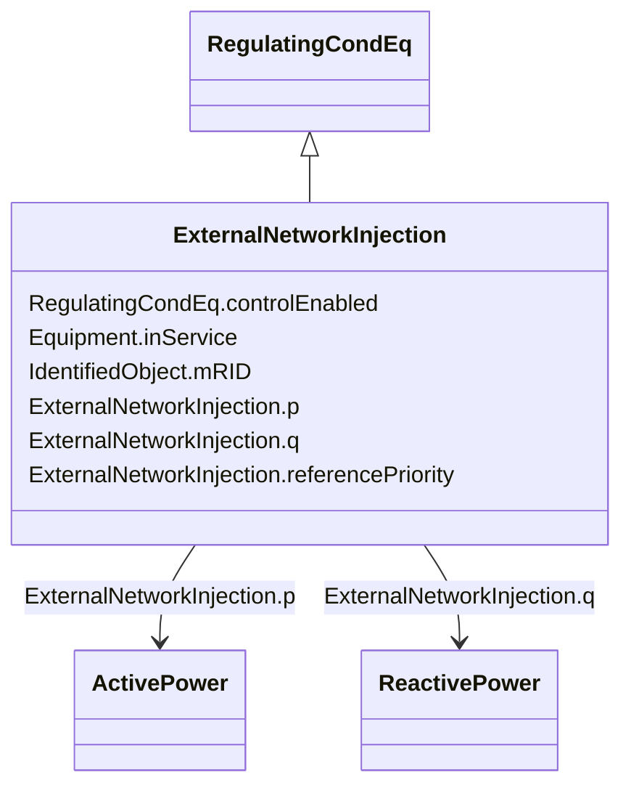

# ExternalNetworkInjection

_This class represents the external network and it is used for IEC 60909 calculations._

**URI**: [cim:ExternalNetworkInjection](http://iec.ch/TC57/CIM100#ExternalNetworkInjection) 
**Type**: Class

## Inheritance
* [IdentifiedObject](IdentifiedObject.md)
    * [PowerSystemResource](PowerSystemResource.md)
        * [Equipment](Equipment.md)
            * [ConductingEquipment](ConductingEquipment.md)
                * [EnergyConnection](EnergyConnection.md)
                    * [RegulatingCondEq](RegulatingCondEq.md)
                        * **ExternalNetworkInjection**

## Attributes

| Name | URI | Cardinality and Range | Description | Inheritance |
| ---  | --- | --- | --- | --- |
| referencePriority | [cim:ExternalNetworkInjection.referencePriority](http://iec.ch/TC57/CIM100#ExternalNetworkInjection.referencePriority) | 1    integer  | Priority of unit for use as powerflow voltage phase angle reference bus selec... | direct |
| p | [cim:ExternalNetworkInjection.p](http://iec.ch/TC57/CIM100#ExternalNetworkInjection.p) | 1    [ActivePower](ActivePower.md)  | Active power injection | direct |
| q | [cim:ExternalNetworkInjection.q](http://iec.ch/TC57/CIM100#ExternalNetworkInjection.q) | 1    [ReactivePower](ReactivePower.md)  | Reactive power injection | direct |
| controlEnabled | [cim:RegulatingCondEq.controlEnabled](http://iec.ch/TC57/CIM100#RegulatingCondEq.controlEnabled) | 1    boolean  | Specifies the regulation status of the equipment | [RegulatingCondEq](RegulatingCondEq.md) |
| inService | [cim:Equipment.inService](http://iec.ch/TC57/CIM100#Equipment.inService) | 1    boolean  | Specifies the availability of the equipment | [Equipment](Equipment.md) |
| mRID | [cim:IdentifiedObject.mRID](http://iec.ch/TC57/CIM100#IdentifiedObject.mRID) | 1    string  | Master resource identifier issued by a model authority | [IdentifiedObject](IdentifiedObject.md) |

## Identifier and Mapping Information

### Schema Source

* from schema: http://iec.ch/TC57/ns/CIM/SteadyStateHypothesis-EU#Package_SteadyStateHypothesisProfile

## Mappings

| Mapping Type | Mapped Value |
| ---  | ---  |
| self | cim:ExternalNetworkInjection |
| native | this:ExternalNetworkInjection |

