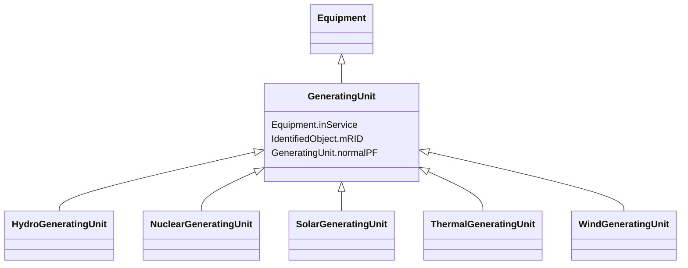

# GeneratingUnit

_A single or set of synchronous machines for converting mechanical power into alternating-current power. For example, individual machines within a set may be defined for scheduling purposes while a single control signal is derived for the set. In this case there would be a GeneratingUnit for each member of the set and an additional GeneratingUnit corresponding to the set._

**URI**: [cim:GeneratingUnit](http://iec.ch/TC57/CIM100#GeneratingUnit) 
**Type**: Class

## Inheritance
* [IdentifiedObject](IdentifiedObject.md)
    * [PowerSystemResource](PowerSystemResource.md)
        * [Equipment](Equipment.md)
            * **GeneratingUnit**
                * [HydroGeneratingUnit](HydroGeneratingUnit.md)
                * [NuclearGeneratingUnit](NuclearGeneratingUnit.md)
                * [SolarGeneratingUnit](SolarGeneratingUnit.md)
                * [ThermalGeneratingUnit](ThermalGeneratingUnit.md)
                * [WindGeneratingUnit](WindGeneratingUnit.md)

## Attributes

| Name | URI | Cardinality and Range | Description | Inheritance |
| ---  | --- | --- | --- | --- |
| normalPF | [cim:GeneratingUnit.normalPF](http://iec.ch/TC57/CIM100#GeneratingUnit.normalPF) | 1    float  | Generating unit economic participation factor | direct |
| inService | [cim:Equipment.inService](http://iec.ch/TC57/CIM100#Equipment.inService) | 1    boolean  | Specifies the availability of the equipment | [Equipment](Equipment.md) |
| mRID | [cim:IdentifiedObject.mRID](http://iec.ch/TC57/CIM100#IdentifiedObject.mRID) | 1    string  | Master resource identifier issued by a model authority | [IdentifiedObject](IdentifiedObject.md) |

## Identifier and Mapping Information

### Schema Source

* from schema: http://iec.ch/TC57/ns/CIM/SteadyStateHypothesis-EU#Package_SteadyStateHypothesisProfile

## Mappings

| Mapping Type | Mapped Value |
| ---  | ---  |
| self | cim:GeneratingUnit |
| native | this:GeneratingUnit |

