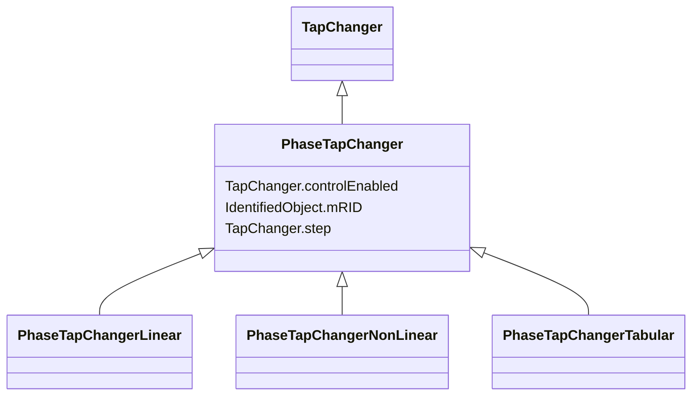

# PhaseTapChanger

_A transformer phase shifting tap model that controls the phase angle difference across the power transformer and potentially the active power flow through the power transformer.  This phase tap model may also impact the voltage magnitude._

**URI**: [cim:PhaseTapChanger](http://iec.ch/TC57/CIM100#PhaseTapChanger) 
**Type**: Class

## Inheritance
* [IdentifiedObject](IdentifiedObject.md)
    * [PowerSystemResource](PowerSystemResource.md)
        * [TapChanger](TapChanger.md)
            * **PhaseTapChanger**
                * [PhaseTapChangerLinear](PhaseTapChangerLinear.md)
                * [PhaseTapChangerNonLinear](PhaseTapChangerNonLinear.md)
                * [PhaseTapChangerTabular](PhaseTapChangerTabular.md)

## Attributes

| Name | URI | Cardinality and Range | Description | Inheritance |
| ---  | --- | --- | --- | --- |
| controlEnabled | [cim:TapChanger.controlEnabled](http://iec.ch/TC57/CIM100#TapChanger.controlEnabled) | 1..1    boolean  | Specifies the regulation status of the equipment | [TapChanger](TapChanger.md) |
| step | [cim:TapChanger.step](http://iec.ch/TC57/CIM100#TapChanger.step) | 1..1    float  | Tap changer position | [TapChanger](TapChanger.md) |
| mRID | [cim:IdentifiedObject.mRID](http://iec.ch/TC57/CIM100#IdentifiedObject.mRID) | 1..1    string  | Master resource identifier issued by a model authority | [IdentifiedObject](IdentifiedObject.md) |

## Identifier and Mapping Information

### Schema Source

* from schema: http://iec.ch/TC57/ns/CIM/SteadyStateHypothesis-EU#Package_SteadyStateHypothesisProfile

## Mappings

| Mapping Type | Mapped Value |
| ---  | ---  |
| self | cim:PhaseTapChanger |
| native | this:PhaseTapChanger |

