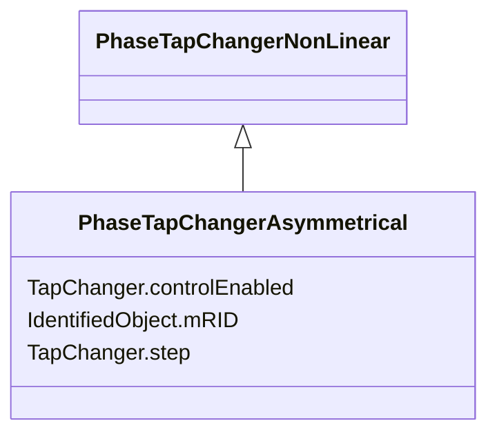

# PhaseTapChangerAsymmetrical

_Describes the tap model for an asymmetrical phase shifting transformer in which the difference voltage vector adds to the in-phase winding. The out-of-phase winding is the transformer end where the tap changer is located.  The angle between the in-phase and out-of-phase windings is named the winding connection angle. The phase shift depends on both the difference voltage magnitude and the winding connection angle._

**URI**: [cim:PhaseTapChangerAsymmetrical](http://iec.ch/TC57/CIM100#PhaseTapChangerAsymmetrical) 
**Type**: Class

## Inheritance
* [IdentifiedObject](IdentifiedObject.md)
    * [PowerSystemResource](PowerSystemResource.md)
        * [TapChanger](TapChanger.md)
            * [PhaseTapChanger](PhaseTapChanger.md)
                * [PhaseTapChangerNonLinear](PhaseTapChangerNonLinear.md)
                    * **PhaseTapChangerAsymmetrical**

## Attributes

| Name | URI | Cardinality and Range | Description | Inheritance |
| ---  | --- | --- | --- | --- |
| controlEnabled | [cim:TapChanger.controlEnabled](http://iec.ch/TC57/CIM100#TapChanger.controlEnabled) | 1    boolean  | Specifies the regulation status of the equipment | [TapChanger](TapChanger.md) |
| step | [cim:TapChanger.step](http://iec.ch/TC57/CIM100#TapChanger.step) | 1    float  | Tap changer position | [TapChanger](TapChanger.md) |
| mRID | [cim:IdentifiedObject.mRID](http://iec.ch/TC57/CIM100#IdentifiedObject.mRID) | 1    string  | Master resource identifier issued by a model authority | [IdentifiedObject](IdentifiedObject.md) |

## Identifier and Mapping Information

### Schema Source

* from schema: http://iec.ch/TC57/ns/CIM/SteadyStateHypothesis-EU#Package_SteadyStateHypothesisProfile

## Mappings

| Mapping Type | Mapped Value |
| ---  | ---  |
| self | cim:PhaseTapChangerAsymmetrical |
| native | this:PhaseTapChangerAsymmetrical |

