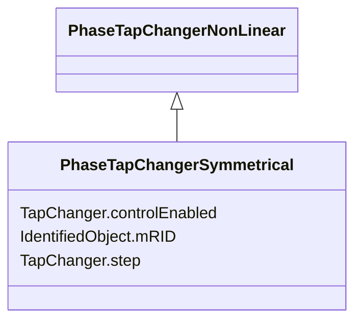

# PhaseTapChangerSymmetrical

_Describes a symmetrical phase shifting transformer tap model in which the voltage magnitude of both sides is the same. The difference voltage magnitude is the base in an equal-sided triangle where the sides corresponds to the primary and secondary voltages. The phase angle difference corresponds to the top angle and can be expressed as twice the arctangent of half the total difference voltage._

**URI**: [cim:PhaseTapChangerSymmetrical](http://iec.ch/TC57/CIM100#PhaseTapChangerSymmetrical) 
**Type**: Class

## Inheritance
* [IdentifiedObject](IdentifiedObject.md)
    * [PowerSystemResource](PowerSystemResource.md)
        * [TapChanger](TapChanger.md)
            * [PhaseTapChanger](PhaseTapChanger.md)
                * [PhaseTapChangerNonLinear](PhaseTapChangerNonLinear.md)
                    * **PhaseTapChangerSymmetrical**

## Attributes

| Name | URI | Cardinality and Range | Description | Inheritance |
| ---  | --- | --- | --- | --- |
| controlEnabled | [cim:TapChanger.controlEnabled](http://iec.ch/TC57/CIM100#TapChanger.controlEnabled) | 1..1    boolean  | Specifies the regulation status of the equipment | [TapChanger](TapChanger.md) |
| step | [cim:TapChanger.step](http://iec.ch/TC57/CIM100#TapChanger.step) | 1..1    float  | Tap changer position | [TapChanger](TapChanger.md) |
| mRID | [cim:IdentifiedObject.mRID](http://iec.ch/TC57/CIM100#IdentifiedObject.mRID) | 1..1    string  | Master resource identifier issued by a model authority | [IdentifiedObject](IdentifiedObject.md) |

## Identifier and Mapping Information

### Schema Source

* from schema: http://iec.ch/TC57/ns/CIM/SteadyStateHypothesis-EU#Package_SteadyStateHypothesisProfile

## Mappings

| Mapping Type | Mapped Value |
| ---  | ---  |
| self | cim:PhaseTapChangerSymmetrical |
| native | this:PhaseTapChangerSymmetrical |

