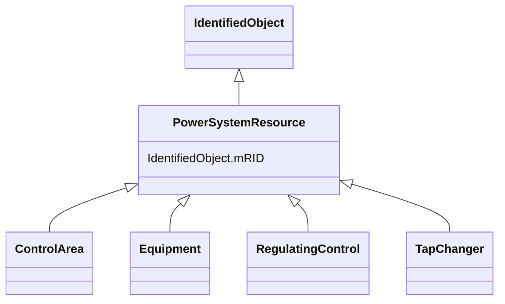

# PowerSystemResource

_A power system resource (PSR) can be an item of equipment such as a switch, an equipment container containing many individual items of equipment such as a substation, or an organisational entity such as sub-control area. Power system resources can have measurements associated._

**URI**: [cim:PowerSystemResource](http://iec.ch/TC57/CIM100#PowerSystemResource) 
**Type**: Class

## Inheritance
* [IdentifiedObject](IdentifiedObject.md)
    * **PowerSystemResource**
        * [ControlArea](ControlArea.md)
        * [Equipment](Equipment.md)
        * [RegulatingControl](RegulatingControl.md)
        * [TapChanger](TapChanger.md)

## Attributes

| Name | URI | Cardinality and Range | Description | Inheritance |
| ---  | --- | --- | --- | --- |
| mRID | [cim:IdentifiedObject.mRID](http://iec.ch/TC57/CIM100#IdentifiedObject.mRID) | 1    string  | Master resource identifier issued by a model authority | [IdentifiedObject](IdentifiedObject.md) |

## Identifier and Mapping Information

### Schema Source

* from schema: http://iec.ch/TC57/ns/CIM/SteadyStateHypothesis-EU#Package_SteadyStateHypothesisProfile

## Mappings

| Mapping Type | Mapped Value |
| ---  | ---  |
| self | cim:PowerSystemResource |
| native | this:PowerSystemResource |

