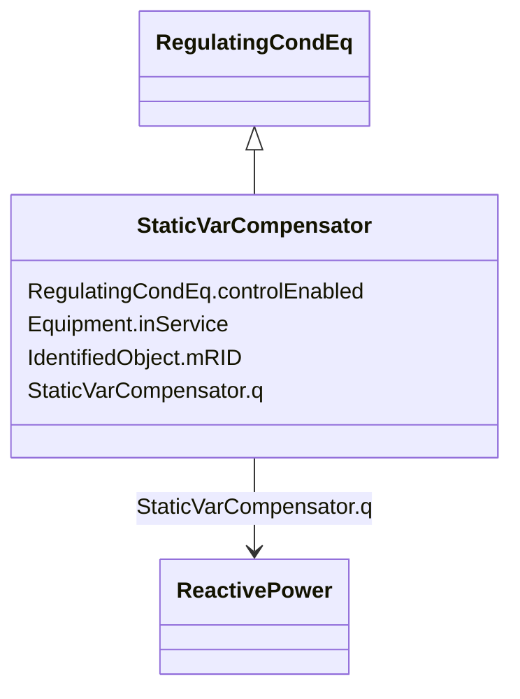

# StaticVarCompensator

_A facility for providing variable and controllable shunt reactive power. The SVC typically consists of a stepdown transformer, filter, thyristor-controlled reactor, and thyristor-switched capacitor arms._

__

_The SVC may operate in fixed MVar output mode or in voltage control mode. When in voltage control mode, the output of the SVC will be proportional to the deviation of voltage at the controlled bus from the voltage setpoint.  The SVC characteristic slope defines the proportion.  If the voltage at the controlled bus is equal to the voltage setpoint, the SVC MVar output is zero._

**URI**: [cim:StaticVarCompensator](http://iec.ch/TC57/CIM100#StaticVarCompensator) 
**Type**: Class

## Inheritance
* [IdentifiedObject](IdentifiedObject.md)
    * [PowerSystemResource](PowerSystemResource.md)
        * [Equipment](Equipment.md)
            * [ConductingEquipment](ConductingEquipment.md)
                * [EnergyConnection](EnergyConnection.md)
                    * [RegulatingCondEq](RegulatingCondEq.md)
                        * **StaticVarCompensator**

## Attributes

| Name | URI | Cardinality and Range | Description | Inheritance |
| ---  | --- | --- | --- | --- |
| q | [cim:StaticVarCompensator.q](http://iec.ch/TC57/CIM100#StaticVarCompensator.q) | 1..1    [ReactivePower](ReactivePower.md)  | Reactive power injection | direct |
| controlEnabled | [cim:RegulatingCondEq.controlEnabled](http://iec.ch/TC57/CIM100#RegulatingCondEq.controlEnabled) | 1..1    boolean  | Specifies the regulation status of the equipment | [RegulatingCondEq](RegulatingCondEq.md) |
| inService | [cim:Equipment.inService](http://iec.ch/TC57/CIM100#Equipment.inService) | 1..1    boolean  | Specifies the availability of the equipment | [Equipment](Equipment.md) |
| mRID | [cim:IdentifiedObject.mRID](http://iec.ch/TC57/CIM100#IdentifiedObject.mRID) | 1..1    string  | Master resource identifier issued by a model authority | [IdentifiedObject](IdentifiedObject.md) |

## Identifier and Mapping Information

### Schema Source

* from schema: http://iec.ch/TC57/ns/CIM/SteadyStateHypothesis-EU#Package_SteadyStateHypothesisProfile

## Mappings

| Mapping Type | Mapped Value |
| ---  | ---  |
| self | cim:StaticVarCompensator |
| native | this:StaticVarCompensator |

