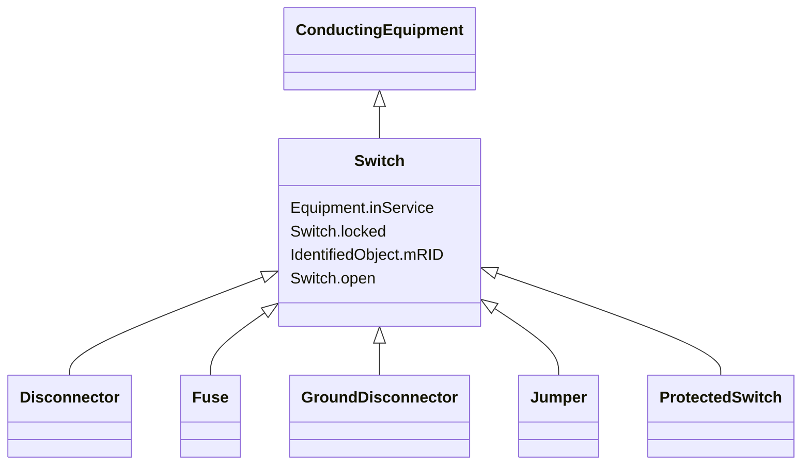

# Switch

_A generic device designed to close, or open, or both, one or more electric circuits.  All switches are two terminal devices including grounding switches. The ACDCTerminal.connected at the two sides of the switch shall not be considered for assessing switch connectivity, i.e. only Switch.open, .normalOpen and .locked are relevant._

**URI**: [cim:Switch](http://iec.ch/TC57/CIM100#Switch) 
**Type**: Class

## Inheritance
* [IdentifiedObject](IdentifiedObject.md)
    * [PowerSystemResource](PowerSystemResource.md)
        * [Equipment](Equipment.md)
            * [ConductingEquipment](ConductingEquipment.md)
                * **Switch**
                    * [Disconnector](Disconnector.md)
                    * [Fuse](Fuse.md)
                    * [GroundDisconnector](GroundDisconnector.md)
                    * [Jumper](Jumper.md)
                    * [ProtectedSwitch](ProtectedSwitch.md)

## Attributes

| Name | URI | Cardinality and Range | Description | Inheritance |
| ---  | --- | --- | --- | --- |
| open | [cim:Switch.open](http://iec.ch/TC57/CIM100#Switch.open) | 1..1    boolean  | The attribute tells if the switch is considered open when used as input to to... | direct |
| locked | [cim:Switch.locked](http://iec.ch/TC57/CIM100#Switch.locked) | 1..1    boolean  | If true, the switch is locked | direct |
| inService | [cim:Equipment.inService](http://iec.ch/TC57/CIM100#Equipment.inService) | 1..1    boolean  | Specifies the availability of the equipment | [Equipment](Equipment.md) |
| mRID | [cim:IdentifiedObject.mRID](http://iec.ch/TC57/CIM100#IdentifiedObject.mRID) | 1..1    string  | Master resource identifier issued by a model authority | [IdentifiedObject](IdentifiedObject.md) |

## Identifier and Mapping Information

### Schema Source

* from schema: http://iec.ch/TC57/ns/CIM/SteadyStateHypothesis-EU#Package_SteadyStateHypothesisProfile

## Mappings

| Mapping Type | Mapped Value |
| ---  | ---  |
| self | cim:Switch |
| native | this:Switch |

