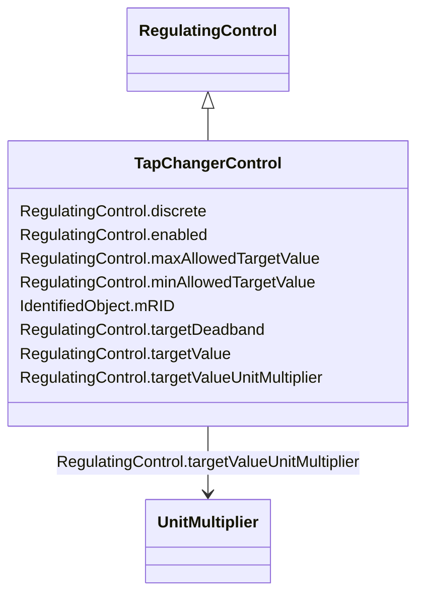

# TapChangerControl

_Describes behaviour specific to tap changers, e.g. how the voltage at the end of a line varies with the load level and compensation of the voltage drop by tap adjustment._

**URI**: [cim:TapChangerControl](http://iec.ch/TC57/CIM100#TapChangerControl) 
**Type**: Class

## Inheritance
* [IdentifiedObject](IdentifiedObject.md)
    * [PowerSystemResource](PowerSystemResource.md)
        * [RegulatingControl](RegulatingControl.md)
            * **TapChangerControl**

## Attributes

| Name | URI | Cardinality and Range | Description | Inheritance |
| ---  | --- | --- | --- | --- |
| discrete | [cim:RegulatingControl.discrete](http://iec.ch/TC57/CIM100#RegulatingControl.discrete) | 1..1    boolean  | The regulation is performed in a discrete mode | [RegulatingControl](RegulatingControl.md) |
| enabled | [cim:RegulatingControl.enabled](http://iec.ch/TC57/CIM100#RegulatingControl.enabled) | 1..1    boolean  | The flag tells if regulation is enabled | [RegulatingControl](RegulatingControl.md) |
| targetDeadband | [cim:RegulatingControl.targetDeadband](http://iec.ch/TC57/CIM100#RegulatingControl.targetDeadband) | 0..1    float  | This is a deadband used with discrete control to avoid excessive update of co... | [RegulatingControl](RegulatingControl.md) |
| targetValue | [cim:RegulatingControl.targetValue](http://iec.ch/TC57/CIM100#RegulatingControl.targetValue) | 1..1    float  | The target value specified for case input | [RegulatingControl](RegulatingControl.md) |
| targetValueUnitMultiplier | [cim:RegulatingControl.targetValueUnitMultiplier](http://iec.ch/TC57/CIM100#RegulatingControl.targetValueUnitMultiplier) | 1..1    [UnitMultiplier](UnitMultiplier.md)  | Specify the multiplier for used for the targetValue | [RegulatingControl](RegulatingControl.md) |
| maxAllowedTargetValue | [cim:RegulatingControl.maxAllowedTargetValue](http://iec.ch/TC57/CIM100#RegulatingControl.maxAllowedTargetValue) | 0..1    float  | Maximum allowed target value (RegulatingControl | [RegulatingControl](RegulatingControl.md) |
| minAllowedTargetValue | [cim:RegulatingControl.minAllowedTargetValue](http://iec.ch/TC57/CIM100#RegulatingControl.minAllowedTargetValue) | 0..1    float  | Minimum allowed target value (RegulatingControl | [RegulatingControl](RegulatingControl.md) |
| mRID | [cim:IdentifiedObject.mRID](http://iec.ch/TC57/CIM100#IdentifiedObject.mRID) | 1..1    string  | Master resource identifier issued by a model authority | [IdentifiedObject](IdentifiedObject.md) |

## Identifier and Mapping Information

### Schema Source

* from schema: http://iec.ch/TC57/ns/CIM/SteadyStateHypothesis-EU#Package_SteadyStateHypothesisProfile

## Mappings

| Mapping Type | Mapped Value |
| ---  | ---  |
| self | cim:TapChangerControl |
| native | this:TapChangerControl |

