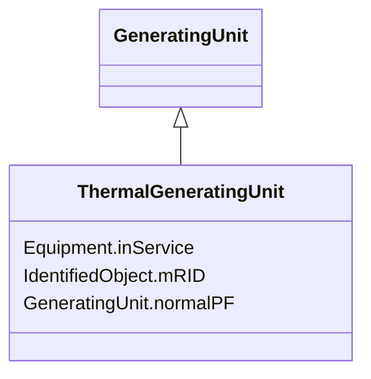

# ThermalGeneratingUnit

_A generating unit whose prime mover could be a steam turbine, combustion turbine, or diesel engine._

**URI**: [cim:ThermalGeneratingUnit](http://iec.ch/TC57/CIM100#ThermalGeneratingUnit) 
**Type**: Class

## Inheritance
* [IdentifiedObject](IdentifiedObject.md)
    * [PowerSystemResource](PowerSystemResource.md)
        * [Equipment](Equipment.md)
            * [GeneratingUnit](GeneratingUnit.md)
                * **ThermalGeneratingUnit**

## Attributes

| Name | URI | Cardinality and Range | Description | Inheritance |
| ---  | --- | --- | --- | --- |
| normalPF | [cim:GeneratingUnit.normalPF](http://iec.ch/TC57/CIM100#GeneratingUnit.normalPF) | 1..1    float  | Generating unit economic participation factor | [GeneratingUnit](GeneratingUnit.md) |
| inService | [cim:Equipment.inService](http://iec.ch/TC57/CIM100#Equipment.inService) | 1..1    boolean  | Specifies the availability of the equipment | [Equipment](Equipment.md) |
| mRID | [cim:IdentifiedObject.mRID](http://iec.ch/TC57/CIM100#IdentifiedObject.mRID) | 1..1    string  | Master resource identifier issued by a model authority | [IdentifiedObject](IdentifiedObject.md) |

## Identifier and Mapping Information

### Schema Source

* from schema: http://iec.ch/TC57/ns/CIM/SteadyStateHypothesis-EU#Package_SteadyStateHypothesisProfile

## Mappings

| Mapping Type | Mapped Value |
| ---  | ---  |
| self | cim:ThermalGeneratingUnit |
| native | this:ThermalGeneratingUnit |

