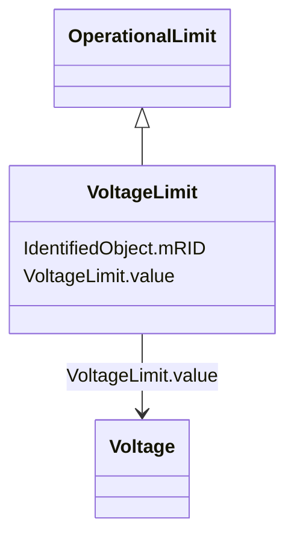

# VoltageLimit

_Operational limit applied to voltage._

_The use of operational VoltageLimit is preferred instead of limits defined at VoltageLevel. The operational VoltageLimits are used, if present._

**URI**: [cim:VoltageLimit](http://iec.ch/TC57/CIM100#VoltageLimit) 
**Type**: Class

## Inheritance
* [IdentifiedObject](IdentifiedObject.md)
    * [OperationalLimit](OperationalLimit.md)
        * **VoltageLimit**

## Attributes

| Name | URI | Cardinality and Range | Description | Inheritance |
| ---  | --- | --- | --- | --- |
| value | [cim:VoltageLimit.value](http://iec.ch/TC57/CIM100#VoltageLimit.value) | 1    [Voltage](Voltage.md)  | Limit on voltage | direct |
| mRID | [cim:IdentifiedObject.mRID](http://iec.ch/TC57/CIM100#IdentifiedObject.mRID) | 1    string  | Master resource identifier issued by a model authority | [IdentifiedObject](IdentifiedObject.md) |

## Identifier and Mapping Information

### Schema Source

* from schema: http://iec.ch/TC57/ns/CIM/SteadyStateHypothesis-EU#Package_SteadyStateHypothesisProfile

## Mappings

| Mapping Type | Mapped Value |
| ---  | ---  |
| self | cim:VoltageLimit |
| native | this:VoltageLimit |

