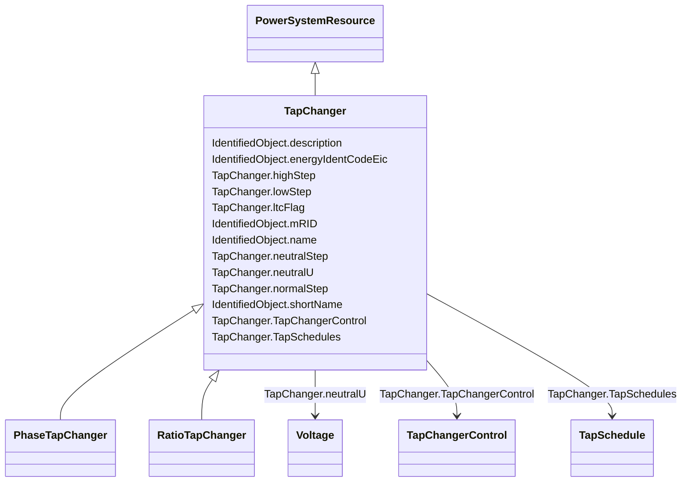

# TapChanger

_Mechanism for changing transformer winding tap positions._

**URI**: [cim:TapChanger](http://iec.ch/TC57/CIM100#TapChanger) 
**Type**: Class

## Inheritance
* [IdentifiedObject](IdentifiedObject.md)
    * [PowerSystemResource](PowerSystemResource.md)
        * **TapChanger**
            * [PhaseTapChanger](PhaseTapChanger.md)
            * [RatioTapChanger](RatioTapChanger.md)

## Attributes

| Name | URI | Cardinality and Range | Description | Inheritance |
| ---  | --- | --- | --- | --- |
| TapSchedules | [cim:TapChanger.TapSchedules](http://iec.ch/TC57/CIM100#TapChanger.TapSchedules) | 0..*    [TapSchedule](TapSchedule.md)  | A TapChanger can have TapSchedules | direct |
| highStep | [cim:TapChanger.highStep](http://iec.ch/TC57/CIM100#TapChanger.highStep) | 1..1    integer  | Highest possible tap step position, advance from neutral | direct |
| lowStep | [cim:TapChanger.lowStep](http://iec.ch/TC57/CIM100#TapChanger.lowStep) | 1..1    integer  | Lowest possible tap step position, retard from neutral | direct |
| ltcFlag | [cim:TapChanger.ltcFlag](http://iec.ch/TC57/CIM100#TapChanger.ltcFlag) | 1..1    boolean  | Specifies whether or not a TapChanger has load tap changing capabilities | direct |
| neutralStep | [cim:TapChanger.neutralStep](http://iec.ch/TC57/CIM100#TapChanger.neutralStep) | 1..1    integer  | The neutral tap step position for this winding | direct |
| neutralU | [cim:TapChanger.neutralU](http://iec.ch/TC57/CIM100#TapChanger.neutralU) | 1..1    [Voltage](Voltage.md)  | Voltage at which the winding operates at the neutral tap setting | direct |
| normalStep | [cim:TapChanger.normalStep](http://iec.ch/TC57/CIM100#TapChanger.normalStep) | 1..1    integer  | The tap step position used in "normal" network operation for this winding | direct |
| TapChangerControl | [cim:TapChanger.TapChangerControl](http://iec.ch/TC57/CIM100#TapChanger.TapChangerControl) | 0..1    [TapChangerControl](TapChangerControl.md)  | The regulating control scheme in which this tap changer participates | direct |
| description | [cim:IdentifiedObject.description](http://iec.ch/TC57/CIM100#IdentifiedObject.description) | 0..1    string  | The description is a free human readable text describing or naming the object | [IdentifiedObject](IdentifiedObject.md) |
| energyIdentCodeEic | [eu:IdentifiedObject.energyIdentCodeEic](http://iec.ch/TC57/CIM100-European#IdentifiedObject.energyIdentCodeEic) | 0..1    string  | The attribute is used for an exchange of the EIC code (Energy identification ... | [IdentifiedObject](IdentifiedObject.md) |
| mRID | [cim:IdentifiedObject.mRID](http://iec.ch/TC57/CIM100#IdentifiedObject.mRID) | 1..1    string  | Master resource identifier issued by a model authority | [IdentifiedObject](IdentifiedObject.md) |
| name | [cim:IdentifiedObject.name](http://iec.ch/TC57/CIM100#IdentifiedObject.name) | 1..1    string  | The name is any free human readable and possibly non unique text naming the o... | [IdentifiedObject](IdentifiedObject.md) |
| shortName | [eu:IdentifiedObject.shortName](http://iec.ch/TC57/CIM100-European#IdentifiedObject.shortName) | 0..1    string  | The attribute is used for an exchange of a human readable short name with len... | [IdentifiedObject](IdentifiedObject.md) |

## Usages

| used by | used in | type | used |
| ---  | --- | --- | --- |
| [TapSchedule](TapSchedule.md) | TapChanger | range | [TapChanger](TapChanger.md) |
| [TapChangerControl](TapChangerControl.md) | TapChanger | range | [TapChanger](TapChanger.md) |

## Identifier and Mapping Information

### Schema Source

* from schema: http://iec.ch/TC57/ns/CIM/CoreEquipment-EU#Package_CoreEquipmentProfile

## Mappings

| Mapping Type | Mapped Value |
| ---  | ---  |
| self | cim:TapChanger |
| native | this:TapChanger |

