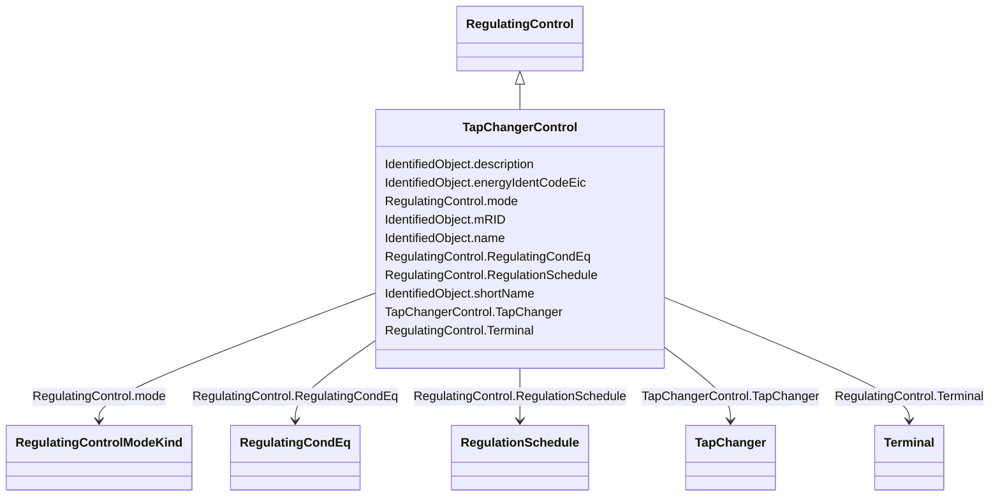

# TapChangerControl

_Describes behaviour specific to tap changers, e.g. how the voltage at the end of a line varies with the load level and compensation of the voltage drop by tap adjustment._

**URI**: [cim:TapChangerControl](http://iec.ch/TC57/CIM100#TapChangerControl) 
**Type**: Class

## Inheritance
* [IdentifiedObject](IdentifiedObject.md)
    * [PowerSystemResource](PowerSystemResource.md)
        * [RegulatingControl](RegulatingControl.md)
            * **TapChangerControl**

## Attributes

| Name | URI | Cardinality and Range | Description | Inheritance |
| ---  | --- | --- | --- | --- |
| TapChanger | [cim:TapChangerControl.TapChanger](http://iec.ch/TC57/CIM100#TapChangerControl.TapChanger) | 1..*    [TapChanger](TapChanger.md)  | The tap changers that participates in this regulating tap control scheme | direct |
| RegulationSchedule | [cim:RegulatingControl.RegulationSchedule](http://iec.ch/TC57/CIM100#RegulatingControl.RegulationSchedule) | 0..*    [RegulationSchedule](RegulationSchedule.md)  | Schedule for this regulating control | [RegulatingControl](RegulatingControl.md) |
| RegulatingCondEq | [cim:RegulatingControl.RegulatingCondEq](http://iec.ch/TC57/CIM100#RegulatingControl.RegulatingCondEq) | 0..*    [RegulatingCondEq](RegulatingCondEq.md)  | The equipment that participates in this regulating control scheme | [RegulatingControl](RegulatingControl.md) |
| mode | [cim:RegulatingControl.mode](http://iec.ch/TC57/CIM100#RegulatingControl.mode) | 1..1    [RegulatingControlModeKind](RegulatingControlModeKind.md)  | The regulating control mode presently available | [RegulatingControl](RegulatingControl.md) |
| Terminal | [cim:RegulatingControl.Terminal](http://iec.ch/TC57/CIM100#RegulatingControl.Terminal) | 1..1    [Terminal](Terminal.md)  | The terminal associated with this regulating control | [RegulatingControl](RegulatingControl.md) |
| description | [cim:IdentifiedObject.description](http://iec.ch/TC57/CIM100#IdentifiedObject.description) | 0..1    string  | The description is a free human readable text describing or naming the object | [IdentifiedObject](IdentifiedObject.md) |
| energyIdentCodeEic | [eu:IdentifiedObject.energyIdentCodeEic](http://iec.ch/TC57/CIM100-European#IdentifiedObject.energyIdentCodeEic) | 0..1    string  | The attribute is used for an exchange of the EIC code (Energy identification ... | [IdentifiedObject](IdentifiedObject.md) |
| mRID | [cim:IdentifiedObject.mRID](http://iec.ch/TC57/CIM100#IdentifiedObject.mRID) | 1..1    string  | Master resource identifier issued by a model authority | [IdentifiedObject](IdentifiedObject.md) |
| name | [cim:IdentifiedObject.name](http://iec.ch/TC57/CIM100#IdentifiedObject.name) | 1..1    string  | The name is any free human readable and possibly non unique text naming the o... | [IdentifiedObject](IdentifiedObject.md) |
| shortName | [eu:IdentifiedObject.shortName](http://iec.ch/TC57/CIM100-European#IdentifiedObject.shortName) | 0..1    string  | The attribute is used for an exchange of a human readable short name with len... | [IdentifiedObject](IdentifiedObject.md) |

## Usages

| used by | used in | type | used |
| ---  | --- | --- | --- |
| [PhaseTapChanger](PhaseTapChanger.md) | TapChangerControl | range | [TapChangerControl](TapChangerControl.md) |
| [PhaseTapChangerAsymmetrical](PhaseTapChangerAsymmetrical.md) | TapChangerControl | range | [TapChangerControl](TapChangerControl.md) |
| [PhaseTapChangerLinear](PhaseTapChangerLinear.md) | TapChangerControl | range | [TapChangerControl](TapChangerControl.md) |
| [PhaseTapChangerNonLinear](PhaseTapChangerNonLinear.md) | TapChangerControl | range | [TapChangerControl](TapChangerControl.md) |
| [PhaseTapChangerSymmetrical](PhaseTapChangerSymmetrical.md) | TapChangerControl | range | [TapChangerControl](TapChangerControl.md) |
| [PhaseTapChangerTabular](PhaseTapChangerTabular.md) | TapChangerControl | range | [TapChangerControl](TapChangerControl.md) |
| [RatioTapChanger](RatioTapChanger.md) | TapChangerControl | range | [TapChangerControl](TapChangerControl.md) |
| [TapChanger](TapChanger.md) | TapChangerControl | range | [TapChangerControl](TapChangerControl.md) |

## Identifier and Mapping Information

### Schema Source

* from schema: http://iec.ch/TC57/ns/CIM/CoreEquipment-EU#Package_CoreEquipmentProfile

## Mappings

| Mapping Type | Mapped Value |
| ---  | ---  |
| self | cim:TapChangerControl |
| native | this:TapChangerControl |

