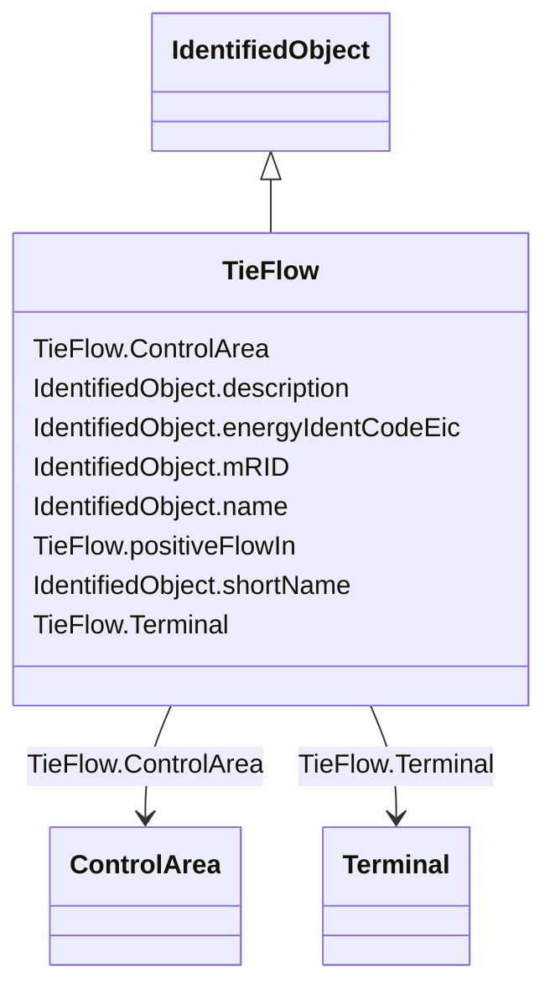

# TieFlow

_Defines the structure (in terms of location and direction) of the net interchange constraint for a control area. This constraint may be used by either AGC or power flow._

**URI**: [cim:TieFlow](http://iec.ch/TC57/CIM100#TieFlow) 
**Type**: Class

## Inheritance
* [IdentifiedObject](IdentifiedObject.md)
    * **TieFlow**

## Attributes

| Name | URI | Cardinality and Range | Description | Inheritance |
| ---  | --- | --- | --- | --- |
| ControlArea | [cim:TieFlow.ControlArea](http://iec.ch/TC57/CIM100#TieFlow.ControlArea) | 1..1    [ControlArea](ControlArea.md)  | The control area of the tie flows | direct |
| Terminal | [cim:TieFlow.Terminal](http://iec.ch/TC57/CIM100#TieFlow.Terminal) | 1..1    [Terminal](Terminal.md)  | The terminal to which this tie flow belongs | direct |
| positiveFlowIn | [cim:TieFlow.positiveFlowIn](http://iec.ch/TC57/CIM100#TieFlow.positiveFlowIn) | 1..1    boolean  | Specifies the sign of the tie flow associated with a control area | direct |
| description | [cim:IdentifiedObject.description](http://iec.ch/TC57/CIM100#IdentifiedObject.description) | 0..1    string  | The description is a free human readable text describing or naming the object | [IdentifiedObject](IdentifiedObject.md) |
| energyIdentCodeEic | [eu:IdentifiedObject.energyIdentCodeEic](http://iec.ch/TC57/CIM100-European#IdentifiedObject.energyIdentCodeEic) | 0..1    string  | The attribute is used for an exchange of the EIC code (Energy identification ... | [IdentifiedObject](IdentifiedObject.md) |
| mRID | [cim:IdentifiedObject.mRID](http://iec.ch/TC57/CIM100#IdentifiedObject.mRID) | 1..1    string  | Master resource identifier issued by a model authority | [IdentifiedObject](IdentifiedObject.md) |
| name | [cim:IdentifiedObject.name](http://iec.ch/TC57/CIM100#IdentifiedObject.name) | 1..1    string  | The name is any free human readable and possibly non unique text naming the o... | [IdentifiedObject](IdentifiedObject.md) |
| shortName | [eu:IdentifiedObject.shortName](http://iec.ch/TC57/CIM100-European#IdentifiedObject.shortName) | 0..1    string  | The attribute is used for an exchange of a human readable short name with len... | [IdentifiedObject](IdentifiedObject.md) |

## Usages

| used by | used in | type | used |
| ---  | --- | --- | --- |
| [ControlArea](ControlArea.md) | TieFlow | range | [TieFlow](TieFlow.md) |
| [Terminal](Terminal.md) | TieFlow | range | [TieFlow](TieFlow.md) |

## Identifier and Mapping Information

### Schema Source

* from schema: http://iec.ch/TC57/ns/CIM/CoreEquipment-EU#Package_CoreEquipmentProfile

## Mappings

| Mapping Type | Mapped Value |
| ---  | ---  |
| self | cim:TieFlow |
| native | this:TieFlow |

