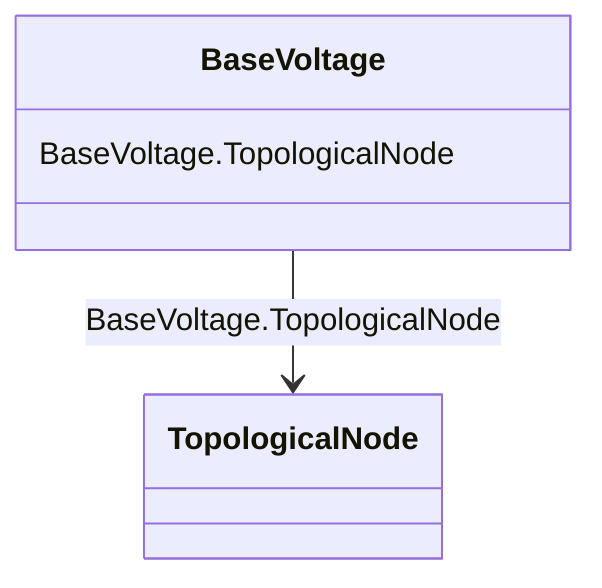

# BaseVoltage

_Defines a system base voltage which is referenced._

**URI**: [cim:BaseVoltage](http://iec.ch/TC57/CIM100#BaseVoltage) 
**Type**: Class

<!-- no inheritance hierarchy -->

## Attributes

| Name | URI | Cardinality and Range | Description | Inheritance |
| ---  | --- | --- | --- | --- |
| TopologicalNode | [cim:BaseVoltage.TopologicalNode](http://iec.ch/TC57/CIM100#BaseVoltage.TopologicalNode) | 0..*    [TopologicalNode](TopologicalNode.md)  | The topological nodes at the base voltage | direct |

## Usages

| used by | used in | type | used |
| ---  | --- | --- | --- |
| [TopologicalNode](TopologicalNode.md) | BaseVoltage | range | [BaseVoltage](BaseVoltage.md) |

## Identifier and Mapping Information

### Schema Source

* from schema: http://iec.ch/TC57/ns/CIM/Topology-EU#Package_TopologyProfile

## Mappings

| Mapping Type | Mapped Value |
| ---  | ---  |
| self | cim:BaseVoltage |
| native | this:BaseVoltage |

